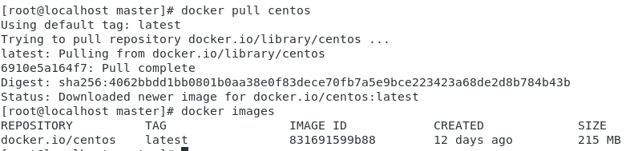
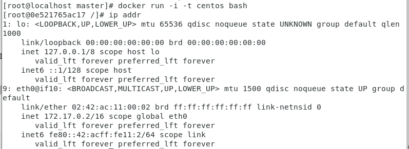
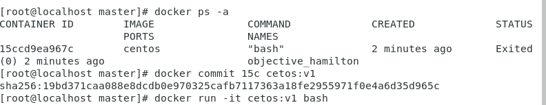
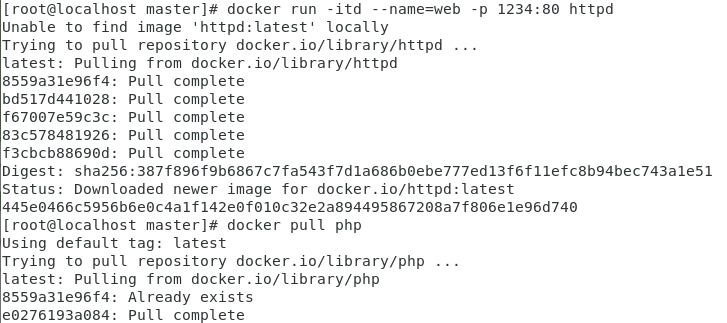
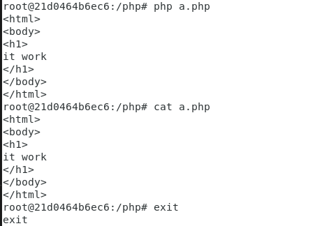

# docker

- docker的安裝
```
yum -y install docker
systemctl start docker
systemctl enable docker
```
- 下載image與查看


- 容器ip



- 將容器commit為image


- run httpd


- run a.php



- 製作image的方式  1)下載別人的,然後登入容器後,安裝做設置完後再產生新的image

