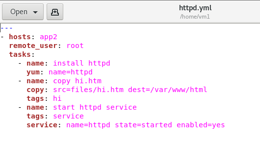

# 0506上課

## anisible playbook
- 在app2安裝httpd並運行 腳本如圖

- 執行結果
```
[root@test-80 vm1]# ansible-playbook httpd.yml

PLAY [app1] **********************************************   **********************

TASK [Gathering Facts] ***********************************   **********************
ok: [192.168.56.110]

TASK [install httpd] *************************************   **********************
ok: [192.168.56.110]

TASK [copy hi.htm] ***************************************   **********************
changed: [192.168.56.110]

TASK [start httpd service] *******************************   **********************
ok: [192.168.56.110]

PLAY RECAP ***********************************************   **********************
192.168.56.110            : ok=4    changed=1    unreacha   ble=0    failed=0
```
- app.yml 對app1安裝套件
```
---
- hosts: app1
  remote_user: root
  tasks:
    - name: install package
      yum: name={{ pkname }}
    - name: start service
      service: name={{ pkname}} state=started enabled=yes
```
- app2.yml
```
---
- hosts: app1
  remote_user: root
  tasks:
    - name: install package
      yum: name={{ pkname1 }}
    - name: install package
      yum: name={{ pkname2 }}
```
執行
```
ansible-playbook -C -e "pkname1=httpd pkname2=vsftpd" app2.yml
```
```
[root@test-80 vm1]# ansible-playbook -C -e "pkname1=httpd pkname2=vsftpd" app2.yml

PLAY [app1] ********************************************************************

TASK [Gathering Facts] *********************************************************
ok: [192.168.56.110]

TASK [install package] *********************************************************
ok: [192.168.56.110]

TASK [install package] *********************************************************
ok: [192.168.56.110]

PLAY RECAP *********************************************************************
192.168.56.110             : ok=3    changed=0    unreachable=0    failed=0
```
- test.yml(更改hostname)
```
---
- hosts: myapp
  remote_user: root
  tasks:
   - name: change hostname
     hostname: name=centos-{{ http_port }}.example.com
```
執行
```
ansible-playbook hostname.yml
```