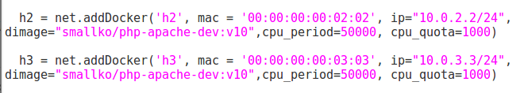
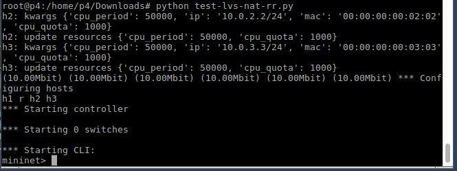
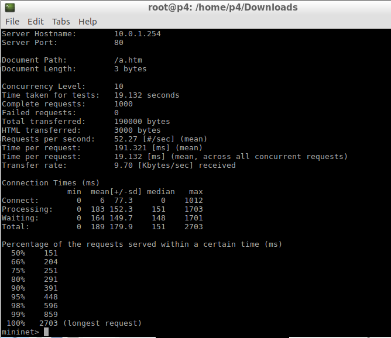
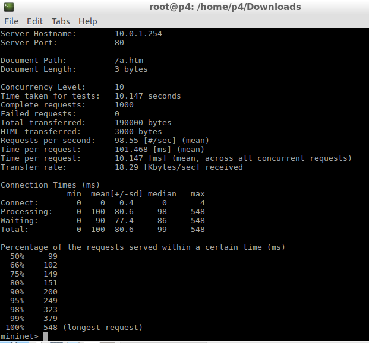

# 0603上課
安裝ubuntu虛擬機
執行20190305-1.py
```
xterm h1 h2
h1 firefox
h2 python -m SimpleHTTPServer 80

ifconfig 介面卡名稱 0 清除網路設定
ip addr add 位址/24 brd + dev 介面卡名稱

docker pull smallko/php-apache-dev:v10
```
更改dimage內的參數

執行 python test-lvs-nat-rr.py


Putty 連線此虛擬機
執行  
```
docker exec -it mn.h2 bash
Cd /var/www
Cd html
Cat a.htm 會顯示h2
```
回到虛擬機


## 練習:新增一個h4
```
#!/usr/bin/env python

from mininet.net import Containernet

from mininet.cli import CLI

from mininet.link import Link,TCLink,Intf

from mininet.log import setLogLevel

from mininet.node import Docker

from time import sleep

 

if '__main__' == __name__:

  setLogLevel('info')

  net = Containernet(link=TCLink)

  h1 = net.addHost('h1',ip="10.0.1.1/24")

  r = net.addHost('r')

  h2 = net.addDocker('h2', mac = '00:00:00:00:02:02', ip="10.0.2.2/24", dimage="smallko/php-apache-dev:v10",cpu_period=50000, cpu_quota=1000)

  h3 = net.addDocker('h3', mac = '00:00:00:00:03:03', ip="10.0.3.3/24", dimage="smallko/php-apache-dev:v10",cpu_period=50000, cpu_quota=1000)

  h4 = net.addDocker('h4', mac = '00:00:00:00:04:04', ip="10.0.4.4/24", dimage="smallko/php-apache-dev:v10",cpu_period=50000, cpu_quota=1000)

  net.addLink(h1, r, cls=TCLink, bw=10)

  net.addLink(h2, r, cls=TCLink, bw=10)

  net.addLink(h3, r, cls=TCLink, bw=10)

  net.addLink(h4, r, cls=TCLink, bw=10)

  net.start()

  h1,h2,h3,h4,r=net.get('h1','h2','h3','h4','r')

  r.cmd("ifconfig r-eth0 0")

  r.cmd("ifconfig r-eth1 0")

  r.cmd("ifconfig r-eth2 0")
  
  r.cmd("ifconfig r-eth3 0")

  r.cmd("echo 1 > /proc/sys/net/ipv4/ip_forward")

  r.cmd("ip addr add 10.0.1.254/24 brd + dev r-eth0")

  r.cmd("ip addr add 10.0.2.254/24 brd + dev r-eth1")

  r.cmd("ip addr add 10.0.3.254/24 brd + dev r-eth2")
  
  r.cmd("ip addr add 10.0.4.254/24 brd + dev r-eth3")

  r.cmd("iptables -t nat -A POSTROUTING -s 10.0.2.0/24 -o r-eth0  -j MASQUERADE")

  r.cmd("iptables -t nat -A POSTROUTING -s 10.0.3.0/24 -o r-eth0  -j MASQUERADE")

  r.cmd("iptables -t nat -A POSTROUTING -s 10.0.4.0/24 -o r-eth0  -j MASQUERADE")

  r.cmd("ipvsadm -A -t 10.0.1.254:80 -s rr")

  r.cmd("ipvsadm -a -t 10.0.1.254:80 -r 10.0.2.2:80 -m")

  r.cmd("ipvsadm -a -t 10.0.1.254:80 -r 10.0.3.3:80 -m")

  r.cmd("ipvsadm -a -t 10.0.1.254:80 -r 10.0.4.4:80 -m")

  h1.cmd("ip route add default via 10.0.1.254")

  h2.cmd("ip route del default")

  h2.cmd("ip route add default via 10.0.2.254")

  h2.cmd("cd /var/www/html; echo h2 > a.htm ; python -m SimpleHTTPServer 80 &")

  h3.cmd("ip route del default")

  h3.cmd("ip route add default via 10.0.3.254")

  h3.cmd("cd /var/www/html; echo h3 > a.htm ; python -m SimpleHTTPServer 80 &")  

  h4.cmd("ip route del default")

  h4.cmd("ip route add default via 10.0.4.254")

  h4.cmd("cd /var/www/html; echo h4 > a.htm ; python -m SimpleHTTPServer 80 &") 

  CLI(net)

  net.stop()
  ```
  - 先執行  python test-lvs-nat-rr.py \
   h1 ab -n 1000 -c 10 http://10.0.1.254/a.htm 測試

	無問題exit執行 python 1.1.py \

若執行1.1.py有問題 
```
docker ps -a
Docker rm -f mn.h2
Docker rm -f mn.h3
Docker rm -f mn.h4 
```
清空完應該就能執行 \
	 h1 ab -n 1000 -c 10 http://10.0.1.254/a.htm 測試


- Mn-c(若出現apr_socket_recv connection refused (111))


