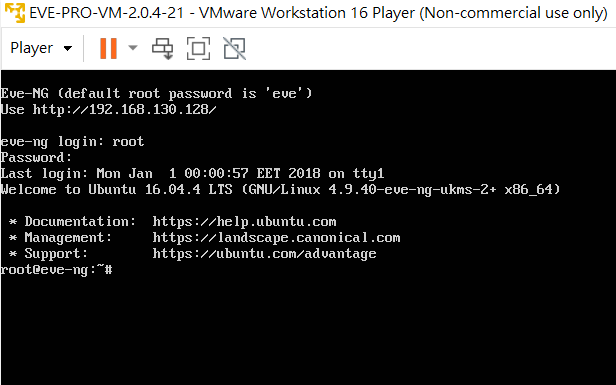
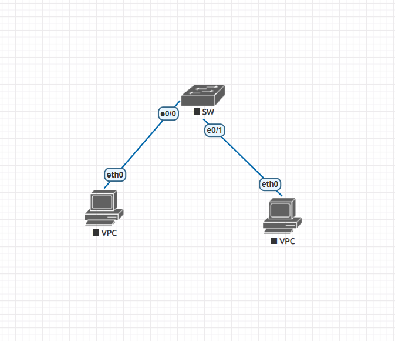
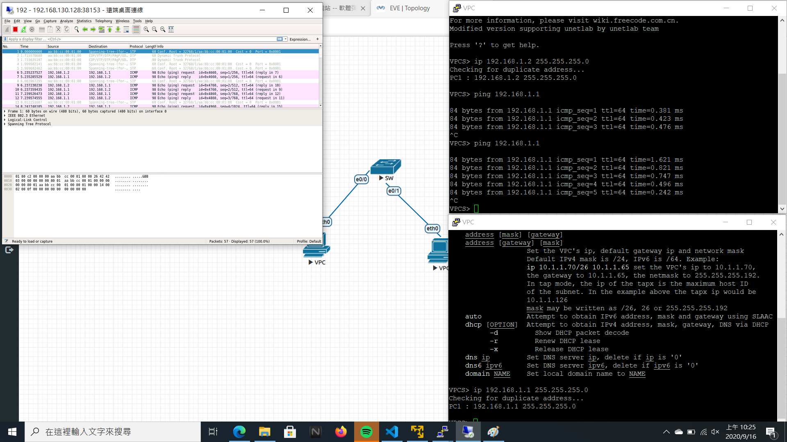

LAN 一個廣播封包能到達的網路  
VLAN 將一個LAN劃分成多個廣播域的技術  
**spanning tree**
- core
- aggregate
- access

**EVE-PRO實驗**
使用VMWARE開啟EVE-PRO虛擬機
- 登入帳號密碼為root/eve

進入上方的IP位置就能進入管理頁面
- 帳號密碼為admin/eve  
加入如下圖的節點

點擊左方選單 more actions/start all nodes 開始連線
接著點擊兩台virturePC節點便能開啟CMD視窗  

**新增ip位置**
- PC1 192.168.1.1 255.255.255.0
- PC2 192.168.1.2 255.255.255.0

- Capture 交換器以打開wireshark  
**成功如下圖**
