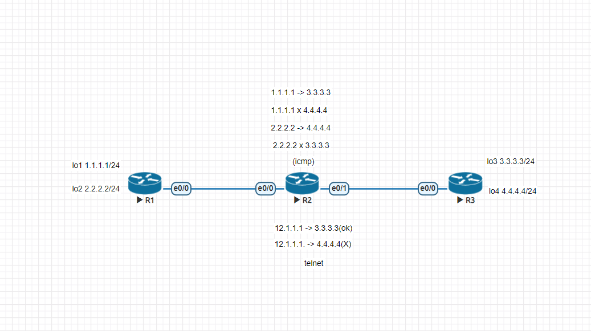

## 第十周上課
- 規則設定  
標準型要愈靠近目的端
延伸型要愈靠近來源端


**icmp**
- R2
```
access-list 100 deny icmp 1.1.1.0 0.0.0.255 4.4.4.0 0.0.0.255
access-list 100 deny icmp 2.2.2.0 0.0.0.255 3.3.3.0 0.0.0.255

access-list 100 permit ip any any
```
**telnet**  
R1可以telnet到R3的3.3.3.3，4.4.4.4則否
- R3
```
line vty 0 4
 password cisco
 login
 transport input telnet
```  
- R2
```
access-list 101 permit tcp any 3.3.3.0 0.0.0.255 eq 23
int e0/1
ip access-group 101 out
```
**Named ACL**
- R2
阻擋R1以telnet連線到R3的4.4.4.4
```
ip access-list extened telnet-acl
deny tcp any 4.4.4.0 0.0.0.255 eq 23
permit ip any any
int e0/1
ip access-group telnet-acl out
```
