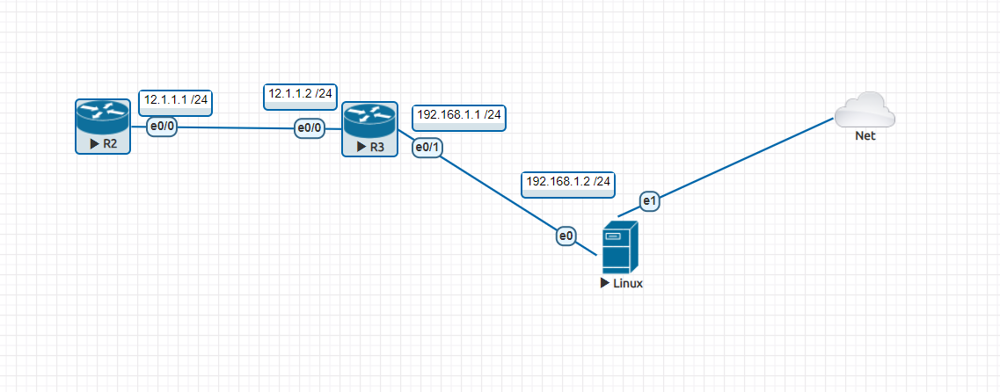
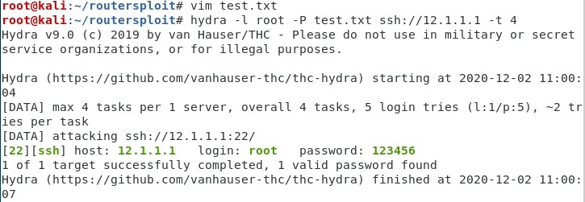

## 第十一周上課

**破解密碼**


- R1 
設定ip
router rip

    - ssh
```
ip aah version 2
crypto key generate rsa (1024)
line vty 0 4
login local 
transport input ssh
```
- R2
設定ip router rip
```
router rip
 version 2
 network 12.0.0.0
 network 192.168.1.0
 no auto-summary
```
- linux
```
ip addr add 192.168.1.2/24 brd + dev eth0
ip route default via 192.168.1.1

vim test.txt 建立一個簡易密碼檔
```

**使用`hydra -l root -P test.txt ssh://12.1.1.1 -t 4`來獲取密碼**


用python控制路由器