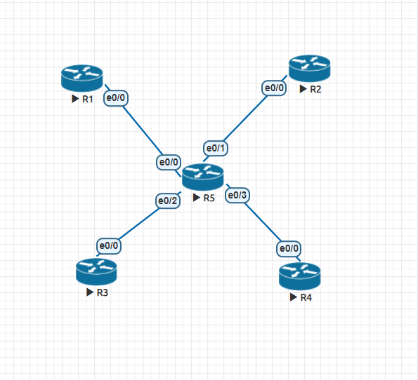

## 第十二週上課

**VRF(Virtual Routing and Forwarding)**

- r1
```
router ospf 1
network 192.168.1.0 0.0.0.255 area 0
```
- r2
```
router ospf 1
network 192.168.3.0 0.0.0.255 area 0
```
- r5 
```
int e0/0
ip vrf forwarding Upper
ip addr 192.168.1.2 255.255.255.0
no shut

int e0/1
ip vrf forwarding Upper
ip addr 192.168.3.2 255.255.255.0
no shut

router ospf 1 vrf Upper 
network 192.168.1.0 0.0.0.255 area 0
network 192.168.3.0 0.0.0.255 area 0
```
Lower同理