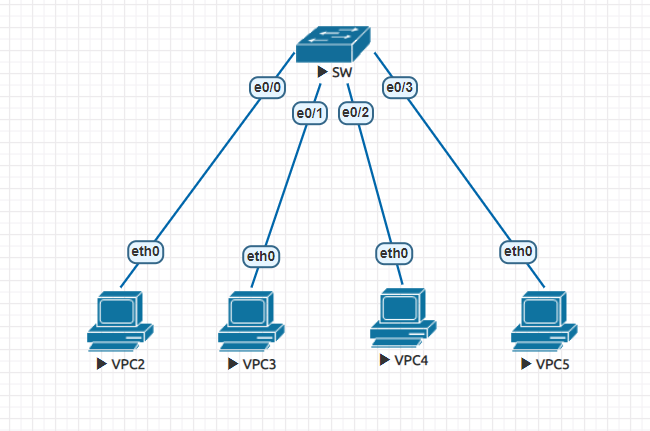
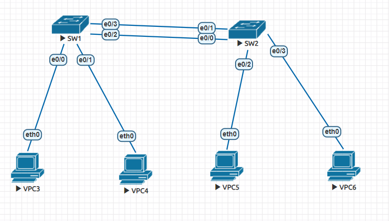
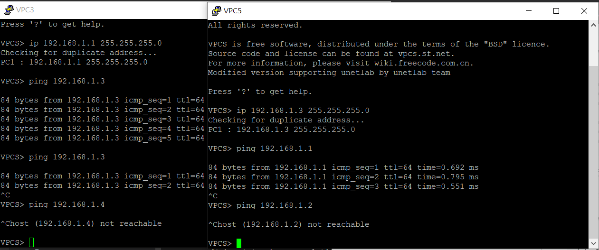
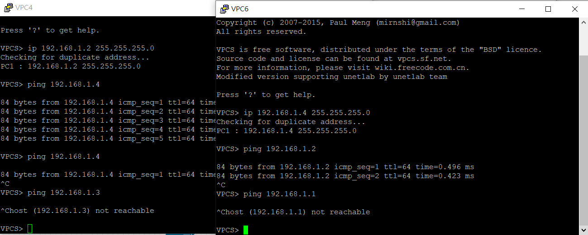
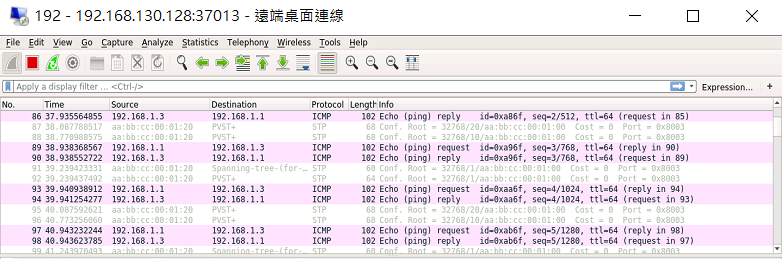
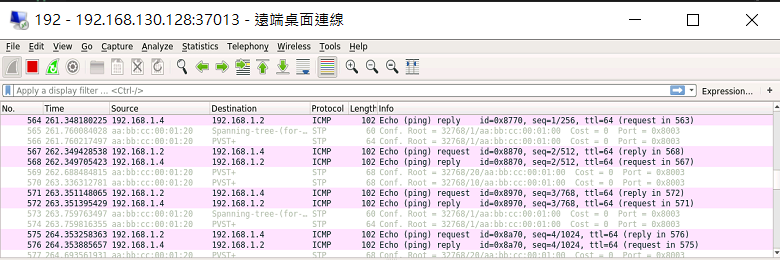
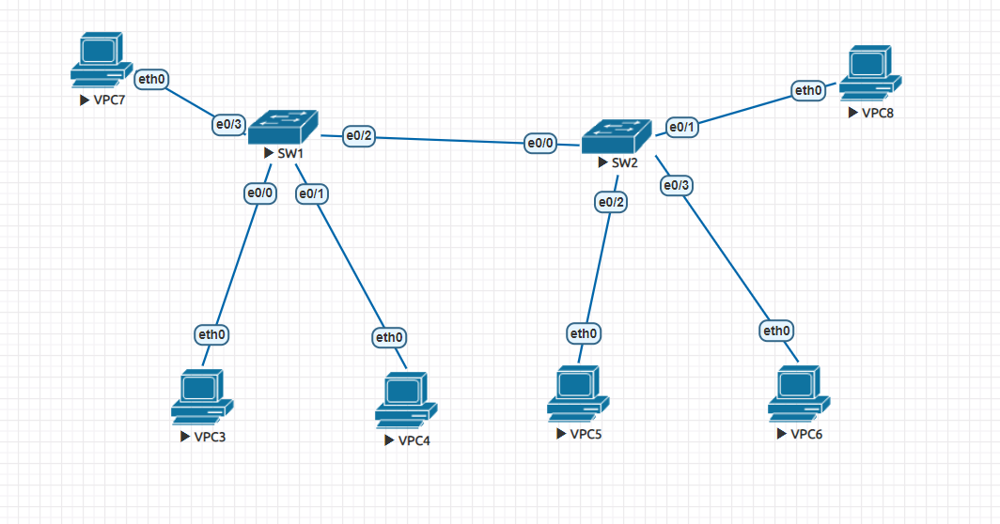
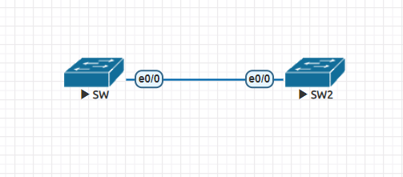

## VLAN

第二層設備有位址學習的功能

default vlan預設值是1 可設定為0-4094，傳輸不須貼標籤  

**簡易vlan**

- VPC2-5
```
ip 192.168.1.x 255.255.255.0
```
- SW
```
show vlan brief

vlan 10 建立vlan
name Vlan10

vlan 20 
name Vlan20

int e0/0
switchport mode access
switchport access vlan 10
int e0/1
switchport mode access
switchport access vlan 10

int e0/2
switchport mode access
switchport access vlan 20
int e0/3
switchport mode access
switchport access vlan 20
```
- 設定完成後2.3為一vlan，4.5為一vlan，僅能與同一vlan的機器通訊。  

**vlan2**

- SW1
```
int range e0/0,e0/2
switchport mode access
switchport access vlan 10

int range e0/1,e0/3
switchport mode access
switchport access vlan 20
```
- SW2
```
int range e0/0,e0/2
switchport mode access
switchport access vlan 10

int range e0/1,e0/3
switchport mode access
switchport access vlan 20
```
- 設定完成後，3.5能互相通訊、4.6能互相通訊  



**trunk應用**
- SW1
```
int e0/2
switchport trunk encapsulation dot1q
switchport mode trunk
```
- SW2
```
int e0/0
switchport trunk encapsulation dot1q
switchport mode trunk
```
- wireshark 擷取
  
  

**將default vlan 1 改成 vlan 10**



- SW1
```
int e0/3
switchport access vlan 1   

int e0/2
switchport trunk native vlan 10
```

- SW2
```
int e0/1
switchport access vlan 1   

int e0/0
switchport trunk native vlan 10
```

**VTP**


- SW1
```
vtp domain mynet
vtp password cisco
do show vtp status

vlan 11-15,1006 #建立vlan

int e0/0
switchport trunk encapsulation dot1q
switchport mode trunk
```
- SW2
```
vtp mode client
vtp domain mynet
vtp password cisco

int e0/0
switchport trunk encapsulation dot1q
switchport mode trunk
```
**在兩接口都設定trunk後，vlan11-15便會出現在SW2中**