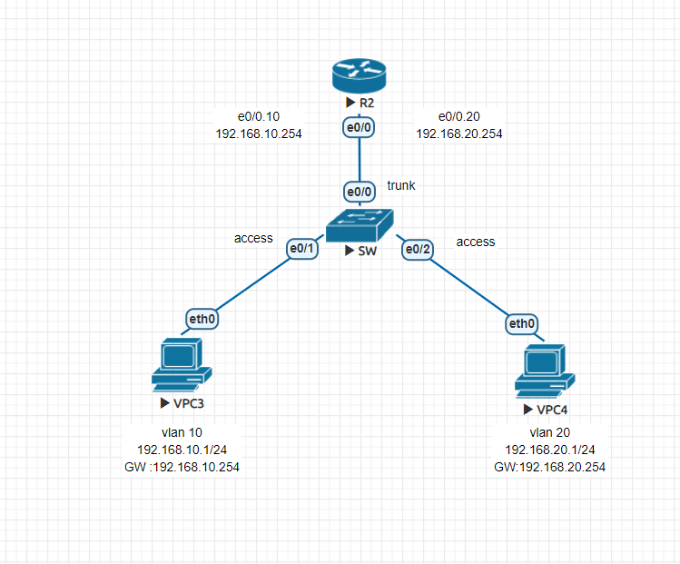
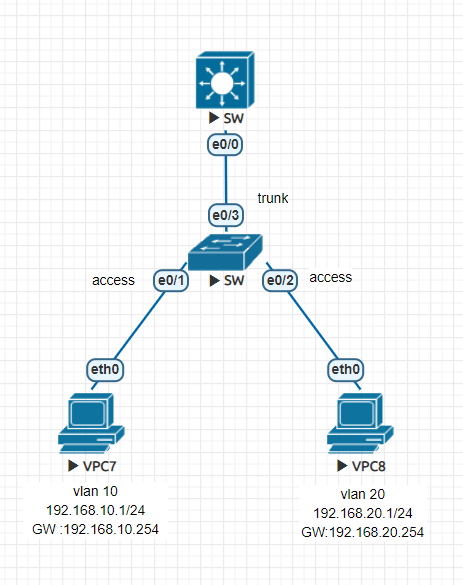
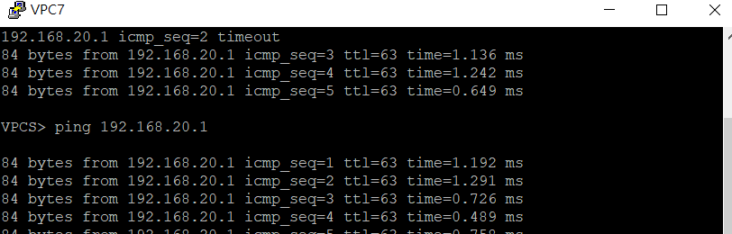

## 第十四週上課

**單臂路由**



- R2
```
int e0/0
no shutsown

int e0/0.10
encapsulation dot1q 10
ip addr 192.168.10.254 255.255.255.0

int e0/0.20
encapsulation dot1q 20
ip addr 192.168.20.254 255.255.255.0
```

- SW
```
vlan 10
vlan 20

int e0/1
switchport mode access
switchport access vlan 10

int e0/2
switchport mode access
switchport access vlan 20

int e0/0
switchport trunk encapsulation dot1q
switchport mode trunk
```

- VPC3
```
ip 192.168.10.1 255.255.255.0 192.168.10.254
```

- VPC4
```
ip 192.168.20.1 255.255.255.0 192.168.20.254
```

**vlan間的通訊方式**



- SW上
```
int e0/0
switchport trunk encapsulation dot1q
switchport mode trunk
exit

vtp mode server
vtp domain ccna
vlan 10
vlan 20

int vlan 10
ip addr 192.168.10.254 255.255.255.0
no shut
int vlan 20
ip addr 192.168.20.254 255.255.255.0
no shut
exit

ip routing 使之有第三層的功能
```

- SW下
```
vlan 10
vlan 20

int e0/1
switchport mode access
switchport access vlan 10

int e0/2
switchport mode access
switchport access vlan 20

int e0/3
switchport trunk encapsulation dot1q
switchport mode trunk
```
- 兩台VPC的設定同上

