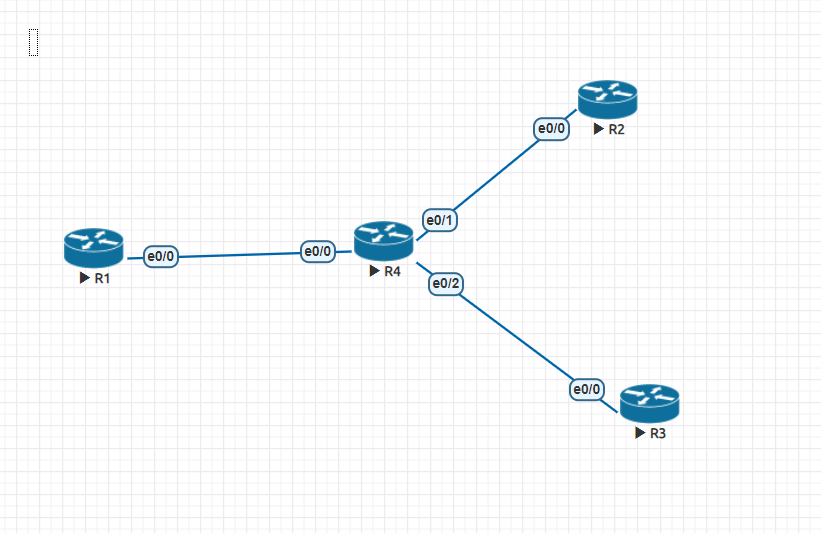
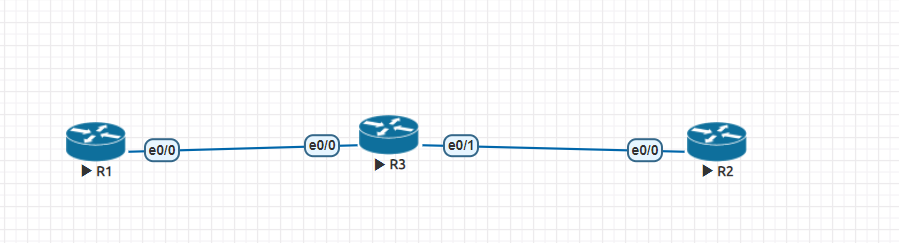
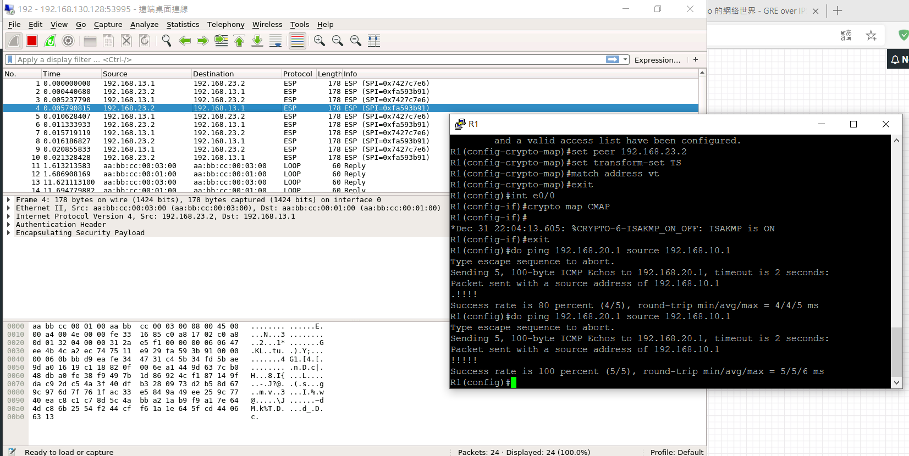

## 第十六週上課

**Hub-to-Spoke Topology**

[教學網頁]("https://www.jannet.hk/zh-Hant/post/generic-routing-encapsulation-gre/")



- R1
```
int lo 0
ip addr 192.168.1.1 255.255.255.0
int e0/0
ip addr 10.0.14.1 255.255.255.0

int tunnel 12
ip addr 172.16.12.1 255.255.255.0
tunnel source e0/0
tunnel destination 10.0.24.2

int tunnel 13
ip addr 172.16.13.1 255.255.255.0
tunnel source e0/0
tunnel destination 10.0.34.3

router rip 
version 2 
network 10.0.14.0
no auto-summary

router eigrp 1 
network 172.16.12.0 0.0.0.255
network 172.16.13.0 0.0.0.255
network 192.168.1.0
```

- R2
```
int lo 0
ip addr 192.168.2.2 255.255.255.0
no shut
int e0/0
ip addr 10.0.24.2 255.255.255.0
no shut
exit

int tunnel 12
ip addr 172.16.12.2 255.255.255.0
tunnel source e0/0
tunnel destination 10.0.14.1
no shut

router rip 
verwion 2
no auto-summary
network 10.0.24.0

router eigrp 1 
no auto-summary
network 172.16.12.0
network 192.168.2.0
```

- R3
```
int lo 0
ip addr 192.168.3.3 255.255.255.0
no shut
int e0/0
ip addr 10.0.34.3 255.255.255.0
no shut

int tunnel 13
ip addr 172.16.13.3 255.255.255.0
tunnel source e0/0
tunnel destination 10.0.14.1
exit

router rip 
version 2
no auto-summary
network 10.0.34.0

router eigrp 1
network 172.16.13.0
network 192.168.3.0
no auto-summary
```

- R4
```
int e0/0
ip addr 10.0.14.4 255.255.255.0
int e0/1
ip addr 10.0.24.4 255.255.255.0
int e0/2
ip addr 10.0.34.4 255.255.255.0

router rip 
vversion 2
network 10.0.14.0
network 10.0.24.0
network 10.0.34.0
no auto-summary
```
**設置完成後R1、R2、R3便能互相通訊**

**IPsec**

- phase 1 建立秘密通道，以交換秘密金鑰

**實驗**

[教學網頁]("https://www.jannet.hk/zh-Hant/post/internet-protocol-security-ipsec/")



- 起始設定
    - R1
    ```
    int e0/0
    ip addr 192.168.13.1 255.255.255.0
    no shut

    int lo 0
    ip addr 192.168.10.1 255.255.255.0
    no shut
    ip route 0.0.0.0 0.0.0.0 192.168.13.3
    ```
    - R2
    ```
    int e0/0
    ip addr 192.168.23.2 255.255.255.0
    no shut

    int lo 0
    ip addr 192.168.20.1 255.255.255.0
    no shut
    ip route 0.0.0.0 0.0.0.0 192.168.23.3
    ```
    - R3
    ```
    int e0/0
    ip addr 192.168.13.3 255.255.255.0
    no shut

    int e0/1
    ip addr 192.168.23.3 255.255.255.0
    no shut
    ```
- 設定Interesting Traffic
    - R1
    ```
    ip access-list extended VPN-Traffic
    permit ip 192.168.10.0 0.0.0.255 192.168.20.0 0.0.0.255
    exit
    ```
    - R2
    ```
    ip access-list extended VPN-Traffic
    permit ip 192.168.20.0 0.0.0.255 192.168.10.0 0.0.0.255
    exit
    ```
- 設定IKE phase 1
    - R1
    ```
    crypto isakmp policy 1
    encryption aes
    hash md5
    authentication pre-share
    group 2
    lifetime 30000
    ```
    - R2
    ```
    crypto isakmp policy 1
    encryption aes
    hash md5
    authentication pre-share
    group 2
    lifetime 30000
    ```
- 設定IKE phase 2
    - R1
    ```
    crypto ipsec transform-set TS esp-3des ah-sha-hmac
    ```
    - R2
    ```
    crypto ipsec transform-set TS esp-3des ah-sha-hmac
    ```
- 設定pre-share key
    - R1
    ```
    crypto isakmp key 6 ccie address 10.0.23.2
    ```
    - R3
    ```
    crypto isakmp key 6 ccie address 10.0.13.1
    ```
- 定義 Crypto Map
    - R1
    ```
    crypto map CMAP 1 ipsec-isakmp
    set peer 10.0.20.3
    set transform-set TS
    match address VPN-Traffic
    exit
    int e0/0
    crypto map CMAP
    ```
    - R2
    ```
    crypto map CMAP 1 ipsec-isakmp
    set peer 10.0.20.3
    set transform-set TS
    match address VPN-Traffic
    exit
    int e0/0
    crypto map CMAP
    ```

    **測試**

    


**參考資料**
[Generic Routing Encapsulation (GRE) 通用路由封裝](https://www.jannet.hk/zh-Hant/post/generic-routing-encapsulation-gre/)
[Internet Protocol Security (IPsec) 網際網路安全協定](https://www.jannet.hk/zh-Hant/post/internet-protocol-security-ipsec/)