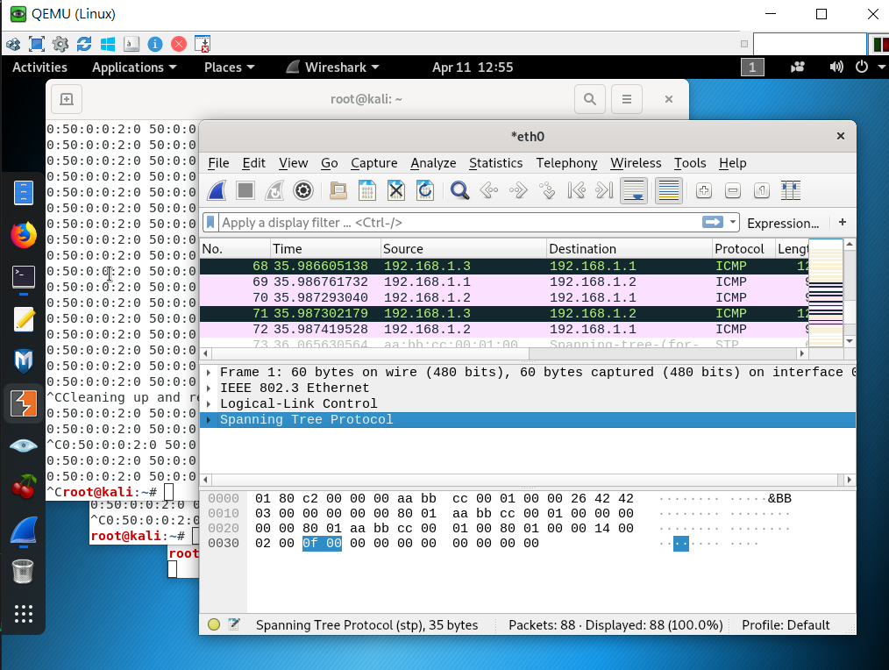

## 第二周上課

**中間人攻擊實驗** 

在EVE-PRO上建置以下環境
  
- VPC 192.168.1.1/24
- WIN 192.168.1.2/24
- Linux 192.168.1.3/24

#### 使用Arpspoof工具做監聽
[示範網頁](https://wizardforcel.gitbooks.io/daxueba-kali-linux-tutorial/content/58.html)

成功後將如下圖所示

router

user mode 
↓  enable  
priviledge mode   (show) 
↓ configuration terminal  
config mode     (do show)