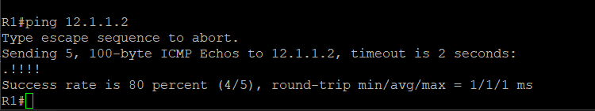
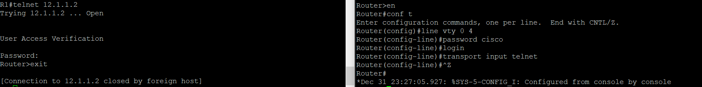
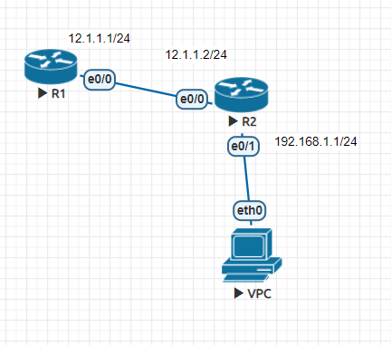
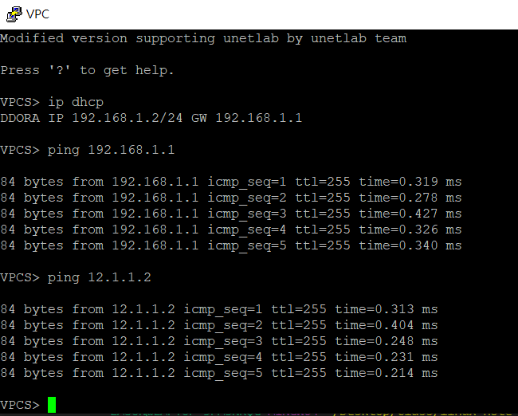

## 第三周上課

- 建立兩台layer 3的router

`conf t(configuration terminal)`:有關設定一定要到此模式

`interface`後可接實體及虛擬介面，例`interface e0/0`  
`hostname 主機名稱`:設定主機名稱  
`show running-config`(sh run)  
`write memory`:將running config 寫入startup config  
`enable password 密碼`:設定明文密碼  
`enable secret 密碼`:加密模式密碼,如有設定,會蓋過enable密碼  

**網路設定 R1與R2**
```
enable
conf t
int e0/0
ip address 12.1.1.1 255.255.255.0
no shutdown
ctrl + z
show ip interface brief 顯示路由器介面設定的資訊
```
設定完成，R1便可ping到R2


`no ip domain lookup`:關閉DNS查詢功能   
`debug ip icmp`:開啟debug模式  
`no debug all`:關閉debug

**telnet連線**
- R2
```
config> line vty 0 4
password cisco
login
transport input telnet
```
- R1
`telnet 12.1.1.2`  



**VPC實驗**

- R2
```
(config)#ip dhcp pool DHCP
network 192.168.1.0 /24
default-router 192.168.1.1
dns-server 8.8.8.8
```
- VPC  
`
ip dhcp
`   
成功後VPC可PING到12.1.1.2及192.168.1.1

