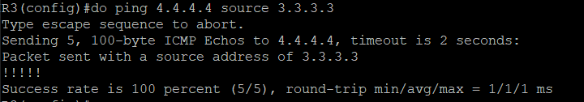
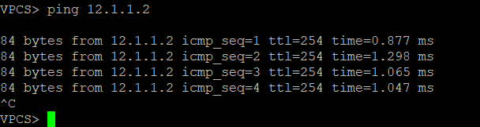

## 第四周上課
**實驗1**


- R3  
```
hostname R3
int e0/0
ip addr 192.168.1.1 255.255.255.0
no shut
int lo 0
ip addr 3.3.3.3 255.255.255.255
exit 
ip route 4.4.4.0 255.255.255.0 e0/0 192.168.1.2
do ping 4.4.4.4 source 3.3.3.3
ip route 5.5.5.0 255.255.255.0 e0/0 192.168.1.3
do ping 5.5.5.5 source 3.3.3.3
```


- R4 
```
hostname R4
int e0/0
ip addr 192.168.1.2 255.255.255.0
no shut
int lo 0
ip addr 4.4.4.4 255.255.255.0
exit 
ip route 3.3.3.0 255.255.255.0 e0/0 192.168.1.1
```

- R5 
```
hostname R5
int e0/0
ip addr 192.168.1.3 255.255.255.0
no shut
int lo 0
ip addr 5.5.5.5 255.255.255.0
exit 
ip route 3.3.3.0 255.255.255.0 e0/0 192.168.1.1
```

**實驗2**
  
* R1
```
hostname r1
int e0/1
ip addr 192.168.1.1 255.255.255.0
no shut 
int e0/0
ip addr 12.1.1.1 255.255.255.0
no shut
exit
ip dhcp pool DHCP1
network 192.168.1.0 /24
default-router 192.168.1.1
dns-server 8.8.8.8
```
- VPC(左)  
`ip dhcp`


* R3
```
hostname R3
int e0/1
ip addr 192.168.2.1 255.255.255.0
no shut 
int e0/0
ip addr 23.1.1.3 255.255.255.0
no shut
exit
ip dhcp pool DHCP2
network 192.168.2.0 /24
default-router 192.168.2.1
dns-server 8.8.8.8
```
- VPC(右)  
`ip dhcp`


* R2
```
hostname R2
int e0/0
ip addr 12.1.1.2 255.255.255.0
no shut 
int e0/1
ip addr 23.1.1.2 255.255.255.0
no shut
ip route 192.168.1.0 255.255.255.0 e0/0 12.1.1.1(使VPC左可以PING到12.1.1.2)
```


- R1
`ip route 23.1.1.0 255.255.255.0 e0/0 12.1.1.2`  
使vpc左可ping到23.1.1.2

- R3
`ip route 192.168.1.0 255.255.255.0 e0/0 23.1.1.2`  
使vpc左可ping到23.1.1.3


- R1
`ip route 192.168.2.0 255.255.255.0 e0/0 12.1.1.2` 
- R2
`ip route 192.168.2.0 255.255.255.0 e0/1 23.1.1.3`  
使VPC左可PING到192.168.2.1

