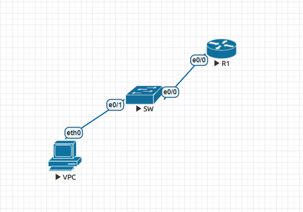
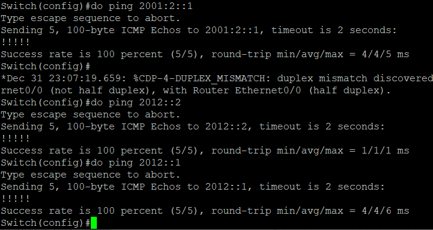
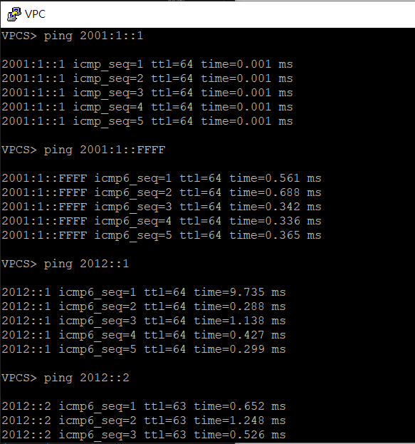
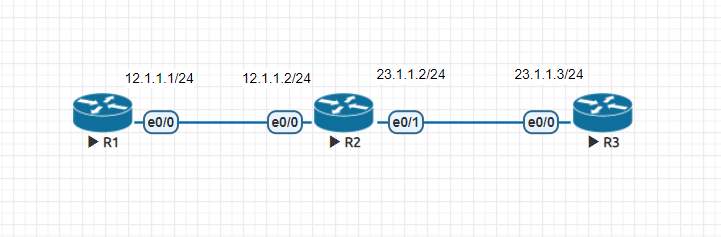

## 第五周上課

**實驗一**


- Router
```
ipv6 unicast-routing
ipv6 route 2001:1::/64 2012::1
int lo 0
ipv6 addr 2001:2::1/64
int e0/0
ipv6 addr 2012::2/64
no shut
```
- SW
```
ipv6 unicast-routing
ipv6 route ::/0 2012::2
int e 0/0
no switchport
ipv6 enable
ipv6 addr 2012::1/64
no shut
```

```
vlan 10
int vlan 10
ipv6 enable
ipv6 addr 2001:1::FFFF/64
no shut
int e0/1
switch mode access
sw access vlan 10
```

- VPC
```
ip 2001:1::1/64 2001:1::FFFF
```


同一資料流

src ip
dst ip
src port
dst port
tcp通訊協定

**RIPv1動態路由**


- R1
```
int e0/0
ip addr 12.1.1.1 255.255.255.0
no shut

router rip 
network 12.1.1.0
```
- R2
```
int e0/0
ip addr 12.1.1.2 255.255.255.0
no shut
int e0/1 
ip addr 23.1.1.2 255.255.255.0
no shut

router rip 
network 12.1.1.0
network 23.1.1.0
```
- R3
```
int e0/0
ip addr 23.1.1.3 255.255.255.0
no shut

router rip 
network 23.1.1.0
```
