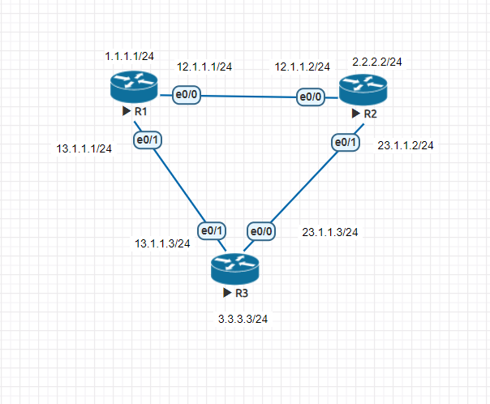
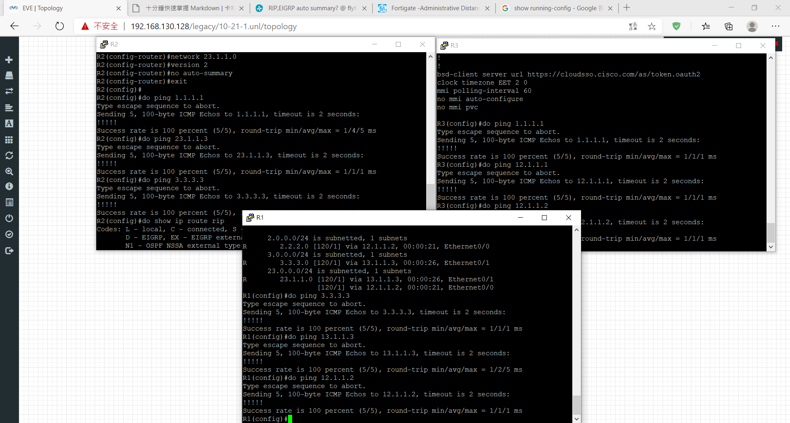
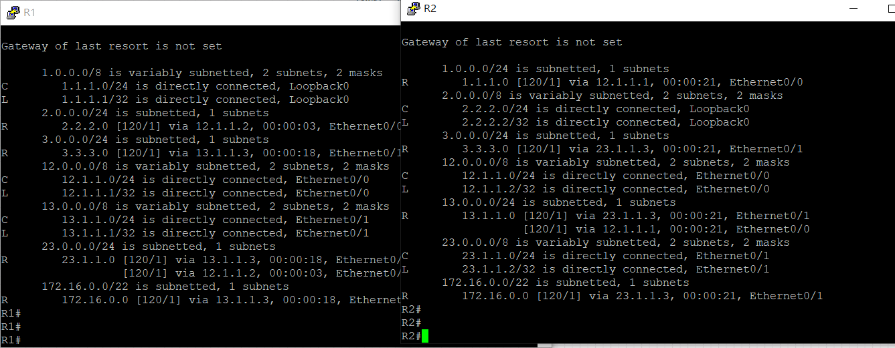

## 第六周上課

|     |  RIPv1 |   RIPv2    |
|  :----:  | :----:  |:----:  |
| Layer  | Application |    Application  |
| VLSM&CIDR  | NO |YES |
| AD  | 120 | 120 |
| Metric  | hop count | hop count |
| Update Method  | broadcast 255.255.255.255 | multicast 224.0.0.9 |
| Auto Summary  | NO | YES |

**RIPv2實驗**  

- R1
```
int lo 0
ip addr 1.1.1.1 255.255.255.0
no shut
int e0/0 
ip addr 12.1.1.1 255.255.255.0
no shut
int e0/1 
ip addr 13.1.1.1 255.255.255.0
no shut

router rip
version 2
no auto-summary
network 1.1.1.0
network 12.1.1.0
network 13.1.1.0
```
- R2
```
int lo 0
ip addr 2.2.2.2 255.255.255.0
no shut
int e0/0 
ip addr 12.1.1.2 255.255.255.0
no shut
int e0/1 
ip addr 23.1.1.2 255.255.255.0
no shut

router rip
version 2
no auto-summary
network 2.2.2.0
network 12.1.1.0
network 23.1.1.0
```
- R2
```
int lo 0
ip addr 2.2.2.2 255.255.255.0
no shut
int e0/0 
ip addr 12.1.1.2 255.255.255.0
no shut
int e0/1 
ip addr 23.1.1.2 255.255.255.0
no shut

router rip
network 12.1.1.0
version 2
no auto-summary
network 23.1.1.0
version 2
no auto-summary
```
- R3
```
int lo 0
ip addr 3.3.3.3 255.255.255.0
no shut
int e0/1
ip addr 13.1.1.3 255.255.255.0
no shut
int e0/0 
ip addr 23.1.1.3 255.255.255.0
no shut

router rip
version 2
no auto-summary
network 3.3.3.0
network 13.1.1.0
network 23.1.1.0
```
**如此一來，三台設備皆能互相通訊**


**Summarization**
- R3
```
先在lo1-4加上172.16.x.1/24
router rip
network 172.16.0.0

int e0/1
ip summary-address rip 172.16.0.0 255.255.252.0
int e0/0
ip summary-address rip 172.16.0.0 255.255.252.0
```


**Default-information Originate**

- R1
```
int e0/0
ip addr 192.168.12.1 255.255.255.0
no shut

router rip
version 2
no auto-summary
network 192.168.12.0
```
- R2
```
int e0/0
ip addr 192.168.12.2 255.255.255.0
no shut
int e0/1
ip addr 192.168.23.2 255.255.255.0
no shut
int lo 1
ip addr 1.1.1.1 255.255.255.0
no shut
int lo 2
ip addr 2.2.2.2 255.255.255.0
no shut

router rip
version 2
no auto-summary
default-information originate
network 192.168.12.0
```
- R3
```
int e0/0
ip addr 192.168.23.3 255.255.255.0
no shut

router rip
version 2
no auto-summary
network 192.168.23.0
```


[Jan Ho 的網絡世界](https://www.jannet.hk/zh-Hant/post/routing-information-protocol-rip/)