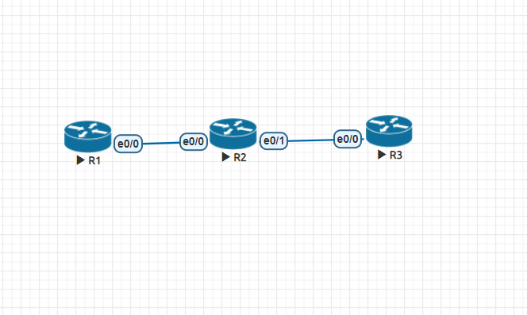

## 第八周上課

**EIGRP** - Enhanced Interior Gateway Routing Protocol

- 採用DUAL Algorithm
- 高級的distance vector 或 Mixed
- IP header protocol:88
- VLSM and CIDR
- AD = 90
- Metrics : bandwidth、delay、(loss load MTU)
- Trigger update : 224.0.0.10

- 使用到的封包類型

|類型 |用途|
|-----|--------|
|Hello  |用於建立與維持neighbor host |
|Update|用於傳送路由條目 |
|Ack  |用於實現可靠傳輸 |
|Query  |用於路由丟失時，向鄰居發送路由請求 |
|Reply |收到路由請求，給與回復 |

- EIGRP所收集的資訊存放在以下三個表中:
    - 鄰居表 show ip eigrp nei  
    - 拓樸表 show ip eigrp topology
    - 路由表 show ip route eigrp

**實驗 EIGRP Neighbor**

- R1
```
int e0/0
ip addr 192.168.12.1 255.255.255.0
no shut

router eigrp 90
network 192.168.12.0 0.0.0.255
```
- R2
```
int e0/0
ip addr 192.168.12.2 255.255.255.0
no shut
int e0/1
ip addr 192.168.23.2 255.255.255.0
no shut

router eigrp 90
network 192.168.12.0 0.0.0.255
network 192.168.23.0 0.0.0.255
```
- R3
```
int e0/0
ip addr 192.168.23.3 255.255.255.0
no shut

router eigrp 90
network 192.168.23.0 0.0.0.255
```
```
show ip eigrp nei 可得知R1的鄰居為R2，R2的鄰居為R1、R3，R3的鄰居為R2
```
