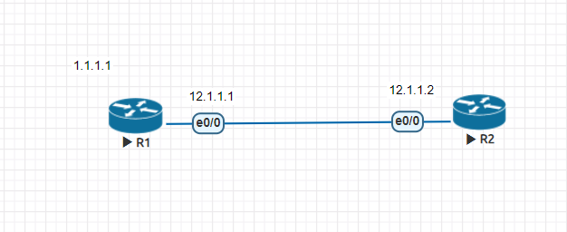
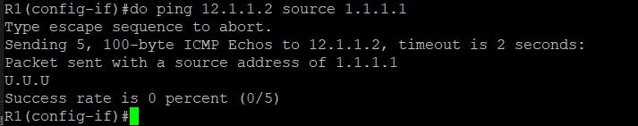

## 11/18上課


- Successor可理解為best path，圖中C節點為successor
- Feasible successor AD必須小於FD
- 不等價負載均衡:可讓大部分走最好路徑，小部分走其他路徑 **variance*FD要大於其他路徑的FD** 

|Network|Neighbor|FD|AD
|-----|:--------:|-----|-----|
|172.16.0.0 |B | 30 | 10 |
|   |C | 20 | 10 |
|   |D | 45 | 25 |

所有規則都無符合，封包會drop
黑名單模式下，最後一筆要加上permit any

簡易防火牆
設定規則
規則要在何接口，指定方向

**ACL實驗**


- R2設定
```
access-list 1 deny host 1.1.1.1
access-list 1 permit any
int e0/0
ip access-group 1 in
```
設定完成後能夠阻擋來自1.1.1.1封包
