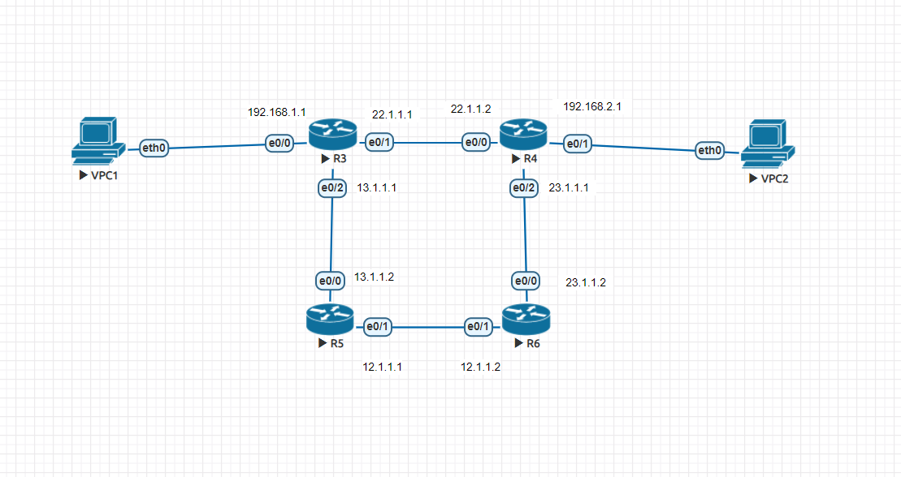
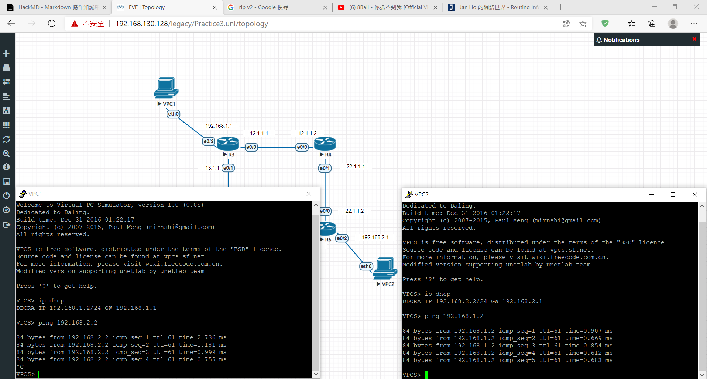

## 練習1


- R3
```
先設定IP

ip dhcp pool DHCP1
network 192.168.1.0 /24
default-router 192.168.1.1
dns-server 8.8.8.8

ip route 192.168.2.0 255.255.255.0 e0/1 22.1.1.2
```
- R4
```
先設定IP

ip dhcp pool DHCP2
network 192.168.2.0 /24
default-router 192.168.2.1
dns-server 8.8.8.8

ip route 12.1.1.0 255.255.255.0 e0/2 23.1.1.2
ip route 192.168.1.0 255.255.255.0 e0/2 23.1.1.2
```
- R6
```
先設定IP

ip route 13.1.1.0 255.255.255.0 e0/1 12.1.1.1
ip route 192.168.1.0 255.255.255.0 e0/1 12.1.1.1
```
- R5
```
先設定IP

ip route 192.168.1.0 255.255.255.0 e0/0 13.1.1.1
```

**設定完成後，VPC1可ping到VPC2，反之亦然。**
