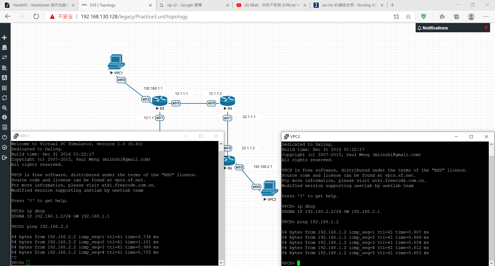

## 練習3


- R3
```
int e0/2
ip addr 192.168.1.1 255.255.255.0
no shut
int e0/0
ip addr 12.1.1.1 255.255.255.0
no shut
int e0/1
ip addr 13.1.1.1 255.255.255.0
no shut

router rip 
version 2
no auto-summary
network 192.168.1.0
network 12.1.1.0
network 13.1.1.0


ip dhcp pool DHCP1
network 192.168.1.0 /24
default-router 192.168.1.1
dns-server 8.8.8.8
exit
```
- R4
```
int e0/0
ip addr 12.1.1.2 255.255.255.0
no shut
int e0/1
ip addr 22.1.1.1 255.255.255.0
no shut

router rip 
version 2
no auto-summary
network 12.1.1.0
network 22.1.1.0
```
- R5
```
int e0/0
ip addr 13.1.1.2 255.255.255.0
no shut
int e0/1
ip addr 23.1.1.1 255.255.255.0
no shut

router rip 
version 2
no auto-summary
network 13.1.1.0
network 23.1.1.0
```
- R6
```
int e0/0
ip addr 22.1.1.2 255.255.255.0
no shut
int e0/1
ip addr 23.1.1.2 255.255.255.0
no shut
int e0/2
ip addr 192.168.2.1 255.255.255.0
no shut

router rip 
version 2
no auto-summary
network 23.1.1.0
network 22.1.1.0
network 192.168.2.0
exit

ip dhcp pool DHCP2
network 192.168.2.0 /24
default-router 192.168.2.1
dns-server 8.8.8.8
exit
```

- VPC1
```
ip dhcp
```
- VPC2
```
ip dhcp
```
**成功後vpc1可ping到vpc2，反之亦然**
