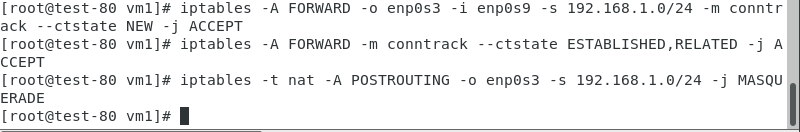
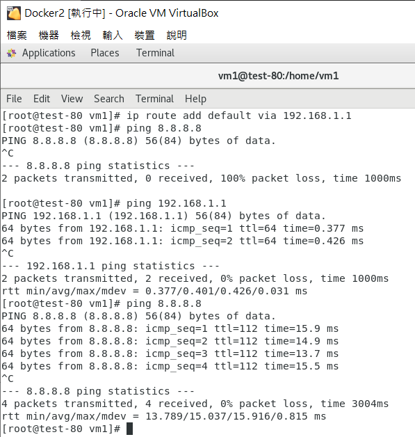
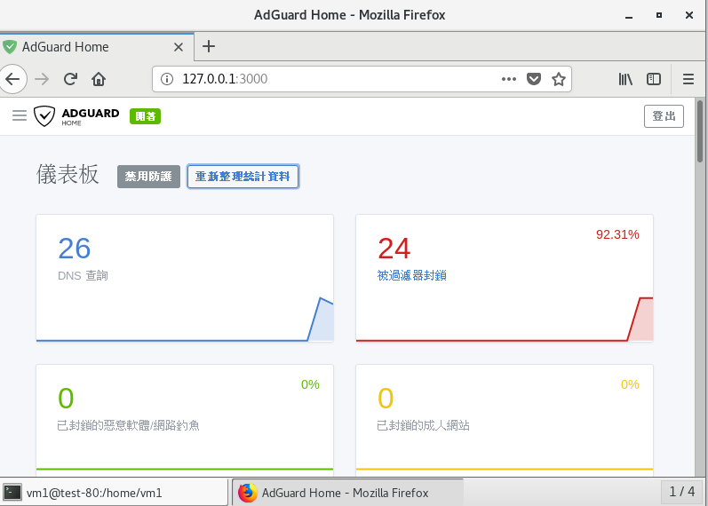

## 第一週上課
設兩台虛擬機
* vm1:NAT及內部網路
* vm2:內部網路

設定 vm1 ip  
`ipaddr add 192.168.1.1/24 brd + dev enp0s9`  
設定 vm2 ip  
`ipaddr add 192.168.1.2/24 brd + dev enp0s3`  
`ip route add default via 192.168.1.1`

* vm1 

`echo 1 > /proc/sys/net/ipv4/ip_forward(路由開啟)`
```
iptables -A FORWARD -o enp0s3 -i enp0s9 -s 192.168.1.0/24 -m conntrack --ctstate NEW -j ACCEPT
iptables -A FORWARD -o enp0s3 -i enp0s9 -s 192.168.1.0/24 -m conntrack --ctstate ESTABLISHED,RELATED -j ACCEPT
iptables -t nat -A POSTROUTING -o enp0s3 -s 192.168.1.0/24 -j MASQUERADE
```



## adguard設置

- 安裝docker
###### 移除舊版docker
```
yum remove docker \
           docker-client \
           docker-client-latest \
           docker-common \
           docker-latest \
           docker-latest-logrotate \
           docker-logrotate \
           docker-engine
```
###### SET UP THE REPOSITORY
```
yum install -y yum-utils

yum-config-manager --add-repo https://download.docker.com/linux/centos/docker-ce.repo
```
###### install docker
```
yum install docker-ce
```

- adguard設置  
[adguard網站](https://hub.docker.com/r/adguard/adguardhome)

###### 1. pull the docker image
```
docker pull adguard/adguardhome
```
###### 2. Create directories for persistent configuration and data
```
mkdir -p /my/won/workdir
mkdir -p /my/own/confdir
```
###### 3. Create and run the container
```
docker run --name adguardhome -v /my/own/workdir:/opt/adguardhome/work -v /my/own/confdir:/opt/adguardhome/conf -p 53:53/tcp -p 53:53/udp -p 67:67/udp -p 68:68/tcp -p 68:68/udp -p 80:80/tcp -p 443:443/tcp -p 853:853/tcp -p 3000:3000/tcp -d adguard/adguardhome
```
- 進入127.0.0.1:3000設置adguard home  
[參考此網站設置](https://www.sakamoto.blog/synology-adguard-home-dns/)
- 管理介面


**兩台虛擬機的DNS在成功時皆是192.168.1.1 應該是只需要改第二台就好**
