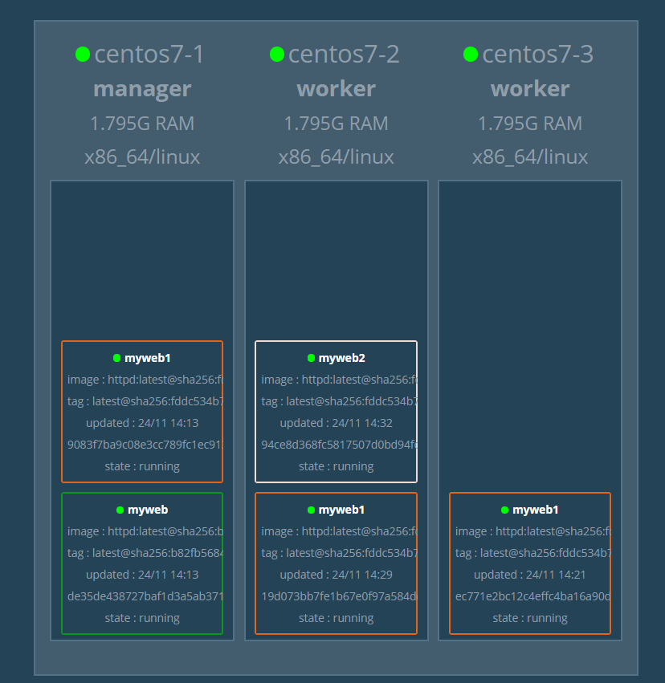
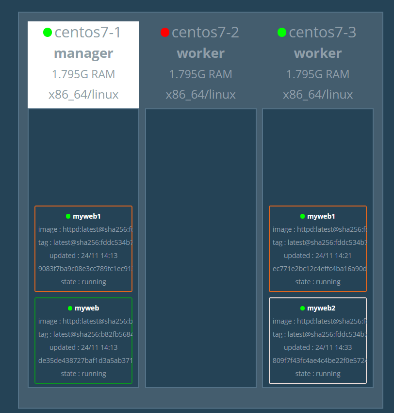
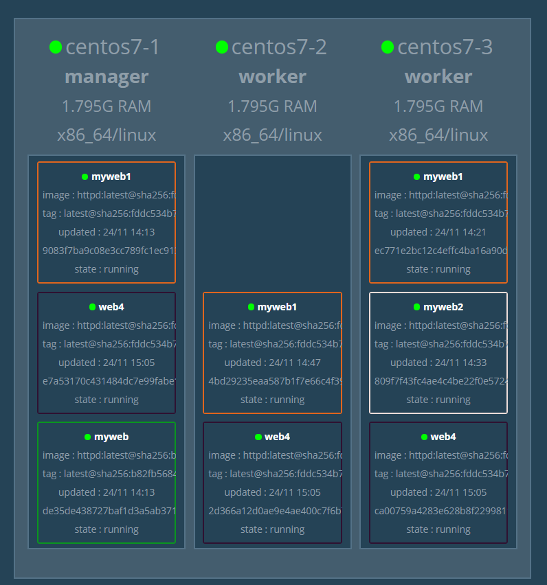

## 第十周上課

**Docker Swarm**

- global模式

**myweb1在7-2關機後僅剩2個copy**
- replicated模式

**myweb2在7-2關機後移動到7-3運行**

- rolling update  
    - 建立web4  
`docker service create --name web4 --replicas 3 -p 8004:80 httpd:2.4.43`
    - 將原先已2.4.43.版本運行的web4更新為latest  
`docker service update --image httpd:latest web4`

