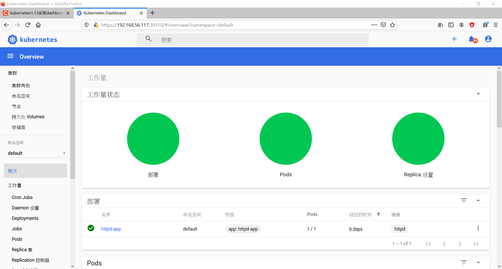

## 第十五周上課

**安裝DASHBOARD**

- 編輯kubernetes-dashboard.yaml
```
kind: Service
apiVersion: v1
metadata:
  labels:
    k8s-app: kubernetes-dashboard
  name: kubernetes-dashboard
  namespace: kube-system
spec:
  type: NodePort
  ports:
    - port: 443
      targetPort: 8443
      nodePort: 30310
  selector:
    k8s-app: kubernetes-dashboard
```
- 編輯admin-role.yaml檔
```
kind: ClusterRoleBinding
apiVersion: rbac.authorization.k8s.io/v1                                                                           
metadata:
  name: admin
  annotations:
    rbac.authorization.kubernetes.io/autoupdate: "true"
roleRef:
  kind: ClusterRole
  name: cluster-admin
  apiGroup: rbac.authorization.k8s.io
subjects:
- kind: ServiceAccount
  name: admin
  namespace: kube-system
---
apiVersion: v1
kind: ServiceAccount
metadata:
  name: admin
  namespace: kube-system
  labels:
    kubernetes.io/cluster-service: "true"
    addonmanager.kubernetes.io/mode: Reconcile
```
- 佈署
```
kubectl apply -f kubernetes-dashboard.yaml
kubectl apply -f admin-role.yaml
```
- 取得token
```
kubectl -n kube-system describe secret $(kubectl -n kube-system get secret | grep admin | awk '{print $1}') | grep token: | awk -F : '{print $2}' | xargs echo
```
- 進入https://192.168.56.117:30310/#!/login



### Helm 
[helm的介紹]("https://cwhu.medium.com/kubernetes-helm-chart-tutorial-fbdad62a8b61")  

**安裝**
```
wget https://get.helm.sh/helm-v3.4.2-linux-amd64.tar.gz

tar xvfz helm-v3.4.2-linux-amd64.tar.gz

cd linux-amd64/

mv helm /usr/local/bin

helm version
```
**指令**
```
helm repo list: 顯示資料庫列表

helm repo add aliyun https://kubernetes.oss-cn-hangzhou.aliyuncs.com/charts: 增加資料庫

helm repo remove aliyun: 刪除資料庫

helm search repo mysql: 查詢資料庫
```