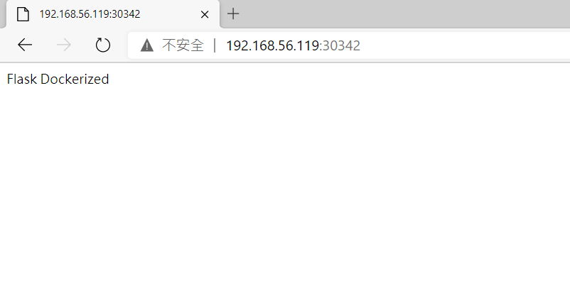
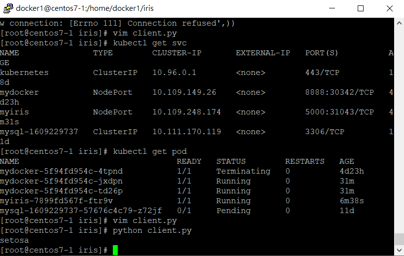
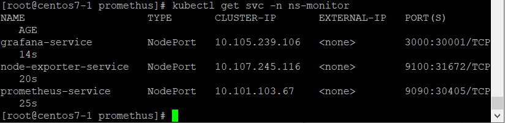
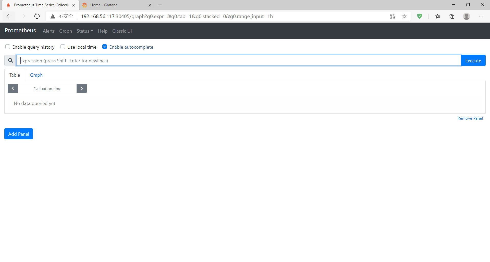
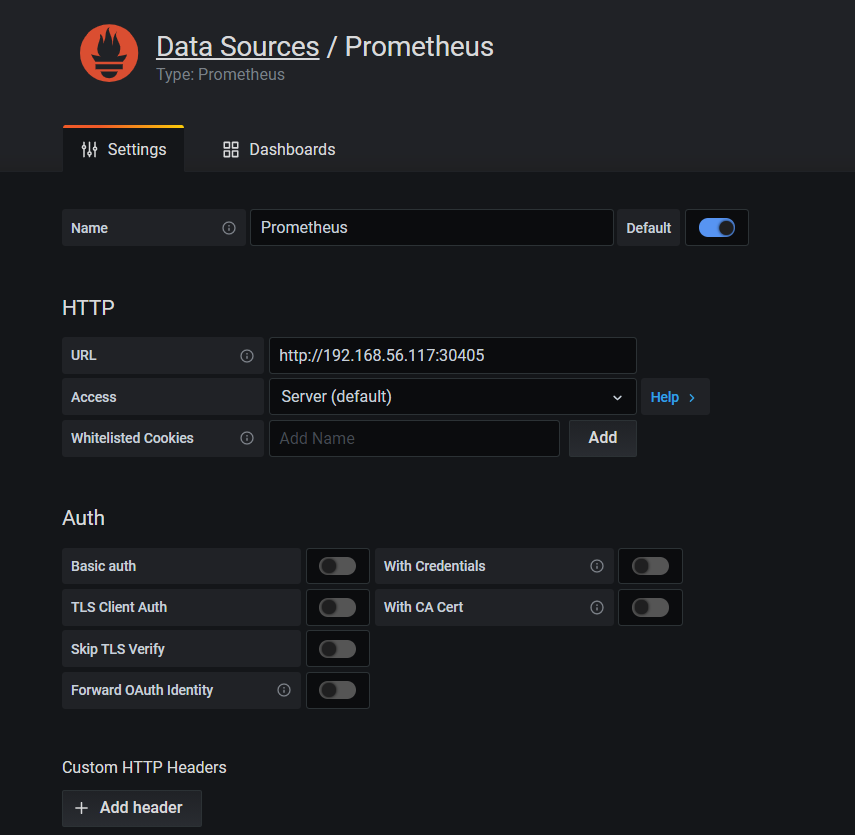
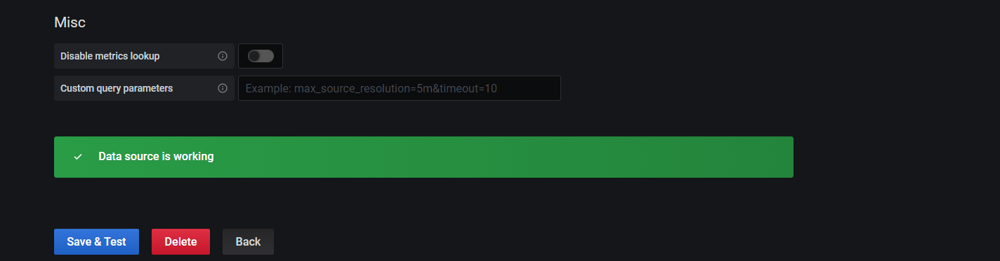
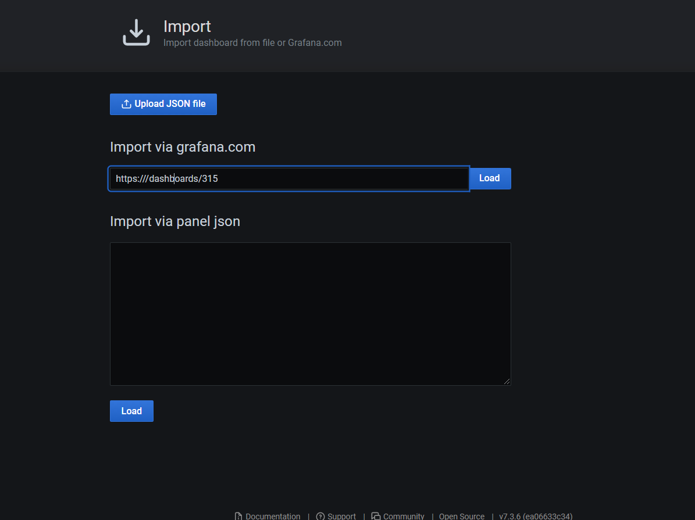
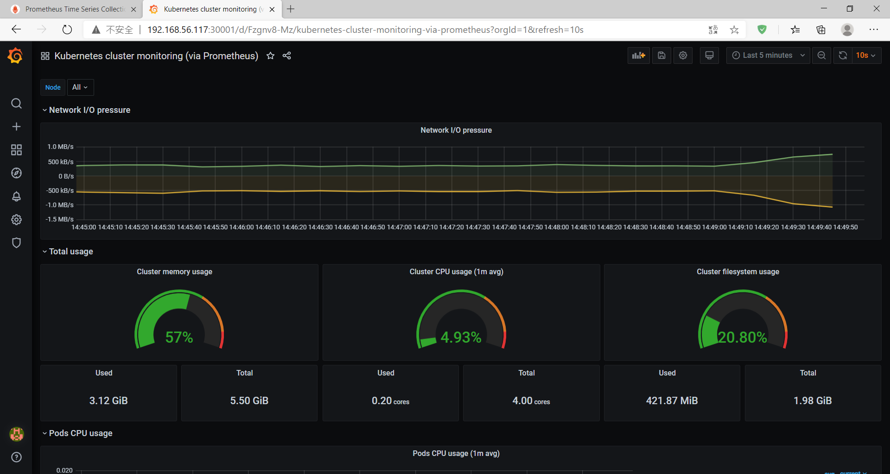

## 第十六週上課

- step 1 . 開發代碼階段
    -  Coding、test、dockerfile
- step 2 . CI/CD(持續交付/集成)
    - 代碼打包、製作鏡像、上傳到鏡像倉庫
- step 3 . 應用佈署
    - 環境準備、pod、service、ingress
- step 4 . 運維
     - 監控、故障檢查、升級優化

**K8S應用佈署**
- 課堂實作

準備以下檔案
- Dockerfile、main.py、requirements.txt  

虛擬機執行
`docker login`
- 建立docker
```
docker build -t mydocker:1.0.0 .
docker run -d -p 8081:8888 --name mydocker mydocker:1.0.0
```
- 上傳Docker Hub
```
[root@centos7-1 docker1]# docker images | grep mydocker
mydocker                               1.0.0                      89e467f36d55        9 minutes ago       938MB
[root@centos7-1 docker1]# docker tag 89e yolo310250/mydocker:1.0.0
[root@centos7-1 docker1]# docker push yolo310250/mydocker:1.0.0
```

**佈署到K8S上**
```
kubectl create deployment mydocker --image=yolo310250/mydocker:1.0.0 --dry-run -o yaml > mydocker-deployment.yaml
```
- 修改replicas為2

- 建置
```
kubectl apply -f mydocker-deployment.yaml

kubectl expose deployment mydocker --port=8888 --target-port=8888 --type=NodePort
    service/mydocker exposed
```


[參考資料]("https://www.maxlist.xyz/2020/01/11/docker-flask/")


**實作**
- docker2  

`vim /etc/docker/daemon.json`
```
{ 
"insecure-registries":["192.168.56.117"] 
}
```
```
systemctl daemon-reload

systemctl restart docker.service

docker login 192.168.56.117
```
- docker1(master)
    - 安裝harbor

    - docker tag 0e0 192.168.56.117/library/myiris:1.0.0

    - docker push 192.168.56.117/library/myiris:1.0.0

    - kubectl create deployment myiris --image=192.168.56.110/library/myiris:1.0.0 --dry-run -o yaml > myiris-deployment.yaml

    - kubectl apply -f myiris-deployment.yaml

    - kubectl expose deployment myiris --port=5000 --target-port=5000 --type=NodePort

    - kubectl get svc : 查看port號

    - vim client.py (將port號改成暴露的port號)

    - python client.py



### Prometheus

**docker1**
- `mkdir prometheus`
- unzip prometheus.zip
- vim grafana.yaml
```
  nfs:
    path: /nfs/prometheus/data
    server: 192.168.56.117
```
- vim prometheus.yaml
```
nfs:
    path: /nfs/prometheus/data
    server: 192.168.56.117
```
- mkdir /nfs/prometheus/data/ -p

- mkdir /nfs/grafana/data/ -p

- vim /etc/exports
```
/nfs/prometheus/data    192.168.56.0/24(rw,sync,no_root_squash,no_all_squash)
/nfs/grafana/data    192.168.56.0/24(rw,sync,no_root_squash,no_all_squash)
```
- systemctl restart nfs

- kubectl apply -f namespace.yaml

- kubectl apply -f prometheus.yaml

- kubectl apply -f node-exporter.yaml

- kubectl apply -f grafana.yaml

- kubectl get svc -n ns-monitor






- Grafana
    - 帳號密碼皆為admin

    - add data source

    
    - 測試成功

    

    - import dashboard
    
    
    
    **成功**

    

- 參考資料

[Kubernetes+Prometheus+Grafana部署笔记-KaliArch-51CTO博客](https://blog.51cto.com/kaliarch/2160569)

[實作 Dockerfile + flask 教學 (附GitHub完整程式) | Max行銷誌](https://www.maxlist.xyz/2020/01/11/docker-flask/)