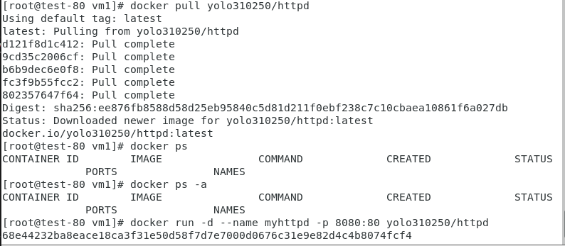

## 第二周上課

**環境架設**

- 開啟兩台虛擬機，網路卡設定為NAT及HOSTONLY各一張，並安裝Docker、Docker Compose並在Docker Hub上建立帳號。
[Docker Compose安裝教學]("https://docs.docker.com/compose/install/")

- Docker只有最上層可做變動，下層皆為Read-Only

* 完整鏡像檔名:來源位置/帳號/鏡像名:tag  
* `docker images`:列出所有docker images
* `docker run -d --name myhttpd -p 8080:80 httpd`
  * d: 背景執行
* `docker stop <ContainerID>`
* `dokcer start <ContainerID>`
* `docker ps`:列出容器
  * `docker ps -a`:列出所有容器，包括未運行的
* `docker rm <containerID>`
  * `docker rmi`:刪除images檔
  * `-f`:強制刪除
  * `docker rm -f $(docker ps -a -q)`:刪除所有container
* `docker tag <containerID> 帳號/httpd:latest`
  * `docker login`
  * `docker push 帳號/httpd:latest`

  
[參考範例](https://ithelp.ithome.com.tw/articles/10191139)

