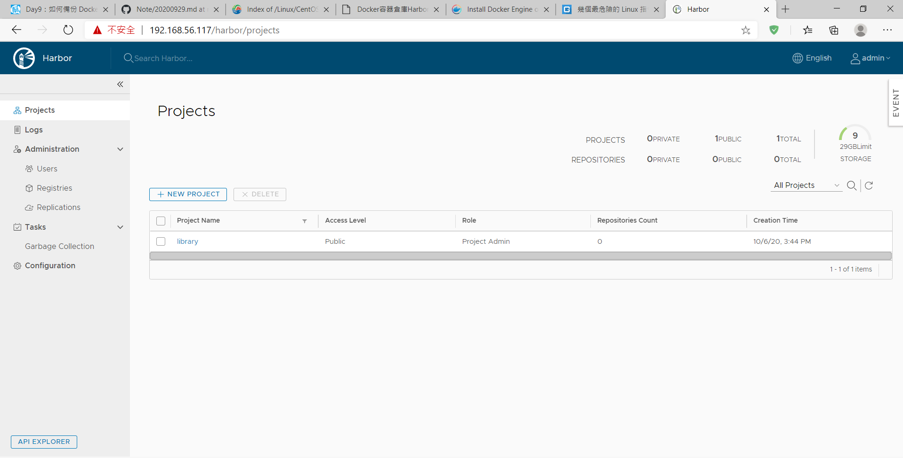
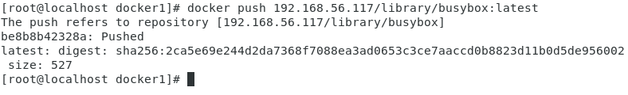
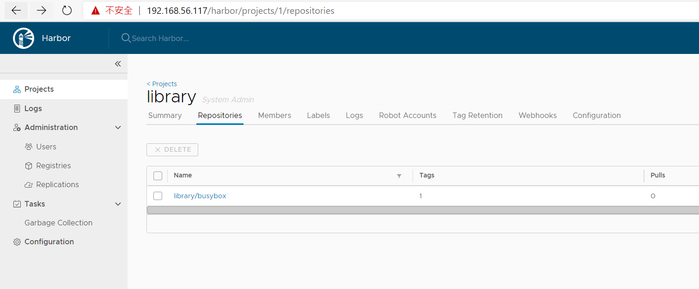

## 第四週上課

`docker save -o myhttpd.tar 417`  
`scp myhttpd.tar vm1@192.168.56.116:/home/vm1`  
[備份docker image](https://ithelp.ithome.com.tw/articles/10191387)  
`docker run -it --name=aa --restart=always`:當docker重啟時，容器自動啟用

**Harbor安裝**  
[參考網頁](https://kknews.cc/zh-tw/code/5n9poj6.html)

- EX image檔推上harbor
    - `docker pull busybox`
    - `docker login 192.168.56.117`
        - username:admin
        - password:hb12345
    - `docker tag 685 192.168.56.117/library/busybox:latest`
    - `docker push 192.168.56.117/library/busybox:latest`

