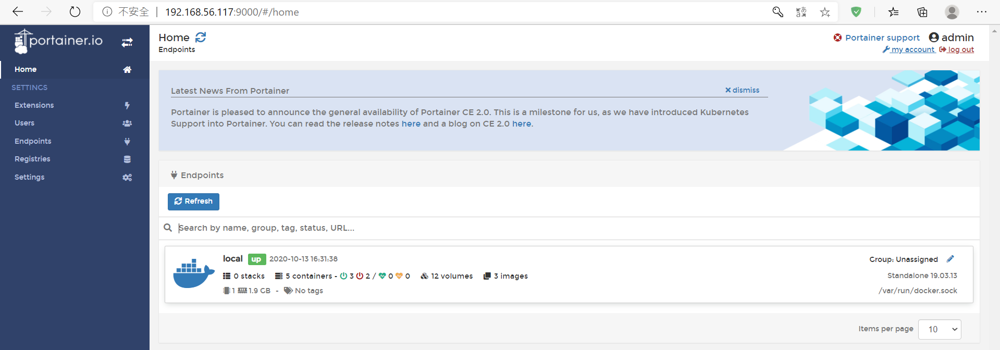

## 第五周上課

**容器互連**

`docker run -it --name c1 busybox sh`  
`docker run -it --name c2 --link c1:c1 busybox sh`  
- 後面所建立之容器可連接前面的，前面則無法


`docker network create --driver bridge mynet`  
`docker run -it --name c3 --network mynet busybox sh`  
`docker run -it --name c3 --network mynet busybox sh`  


**Portainer**

- 安裝
```
docker run -d -p 9000:9000 --restart=always --name portainer -v /var/run/docker.sock:/var/run/docker.sock -v /Users/lee/dev/docker_file/portainer/data:/data docker.io/portainer/portainer
```


**Dockerfile**

 - FROM:使用的docker image的名稱  
        格式為 `FROM <image>`或`FROM <image>:<tag>`。
- MAINTAINER:用來說明，撰寫和維護這個 Dockerfile 的人是誰。`MAINTAINER <name>`。  
- RUN:用來執行Linux指令。
- ADD： 把 Local 的檔案複製到 Image 裡，如果是 tar.gz 檔複製進去 Image 時會順便自動解壓縮。
- ENV： 用來設定環境變數。`ENV <KEY> <Value>`

