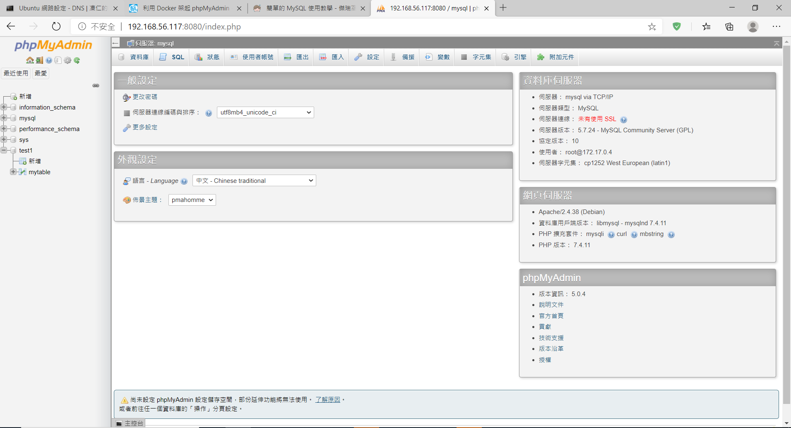
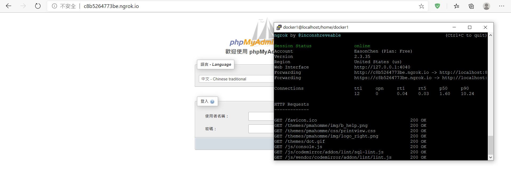
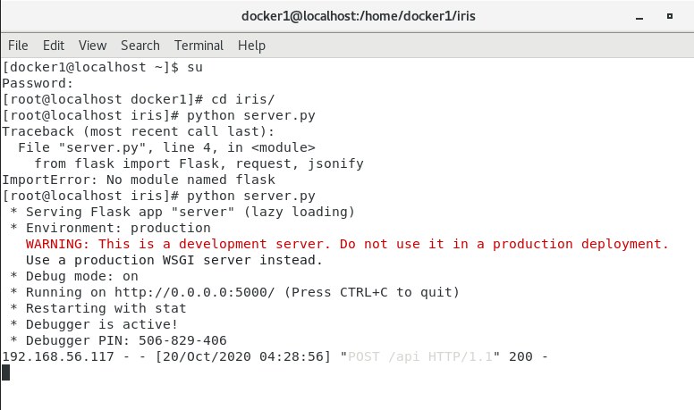
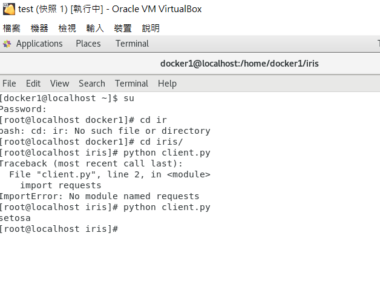

## 第六周上課

**Ex1**

- MySQL  
`docker run -itd --name mysql -p 3306:3306 -e MYSQL_ROOT_PASSWORD=root mysql:5.7.24`
- phpMyAdmin  
`docker run --name phpmyadmin -d --link mysql -e PMA_HOST="mysql" -p 8080:80 phpmyadmin/phpmyadmin`



- 建立/刪除資料庫、資料表
    - 建立/刪除 test1 資料庫
    ```
    create database test1;
    use test1;
    show tables;
    drop database test1;
    ```
    - 建立/刪除 mytable 資料表
    ```
    create table mytable(school char(5),name char(10),id int);
    show tables;
    describe mytable;
    drop table mytable;
    ```

- 資料表查詢  
`select * from mytable ;`
- 新增資料  
`insert into mytable(school, name, id) values ('NCTU','Jerry','123');`
- 更新資料  
`update mytable set name = 'HaHa' where id = '123';`
- 刪除資料  
`delete from mytable where name = 'HaHa';`

**ngrok**

- 安裝  
`wget https://bin.equinox.io/c/4VmDzA7iaHb/ngrok-stable-linux-amd64.zip`
- 解壓縮  
`unzip ngrok-stable-linux-amd64.zip`
- Connect your account  
`./ngrok authtoken 1j8Ct9DKgnnggsrmUTGNfbBkXyT_4ndhFbrzAYQ6567Dq4ACR`
- 運行  
`./ngrok http 埠號` 



**實驗**   
[參考內容](http://wulc.me/2019/04/19/%E9%80%9A%E8%BF%87%20Flask,%20Docker,%20Jenkins%20%E5%92%8C%20Kubernets%20%E9%83%A8%E7%BD%B2%E6%9C%BA%E5%99%A8%E5%AD%A6%E4%B9%A0%E6%A8%A1%E5%9E%8B/)  

首先在虛擬機上編輯以下檔案  
train_model.py、server.py、client.py

```
yum install epel-release
yum install python-pip -y
pip install sklearn
pip install flask
pip install requests
```

