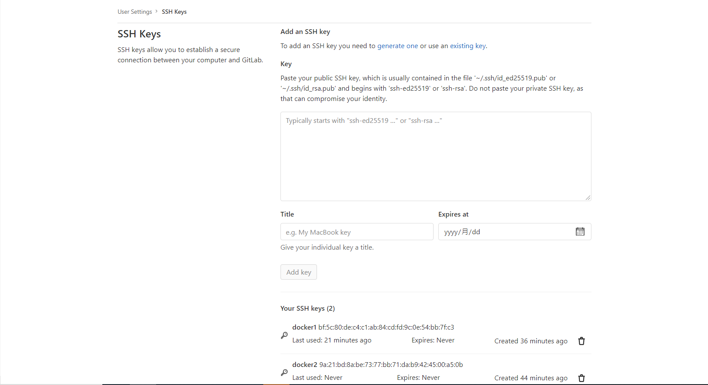
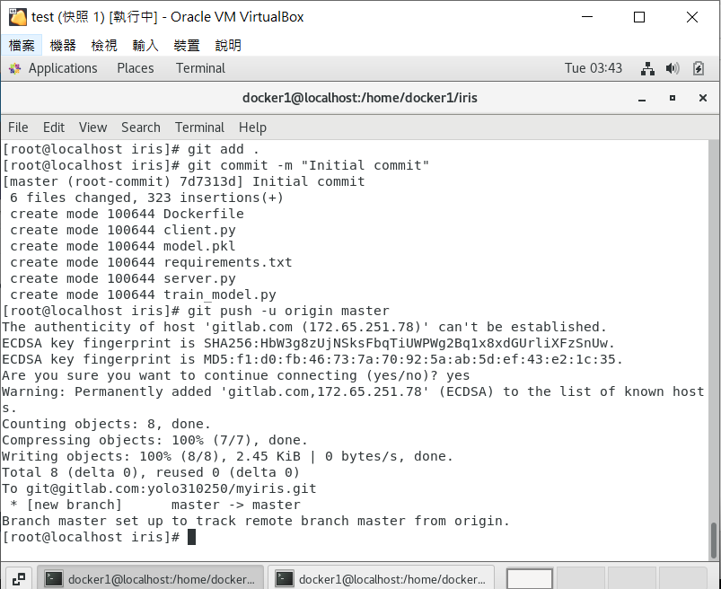
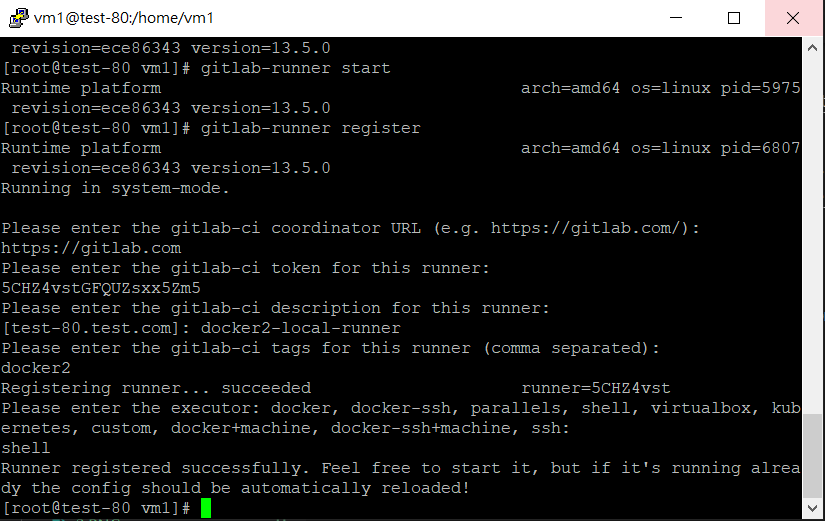
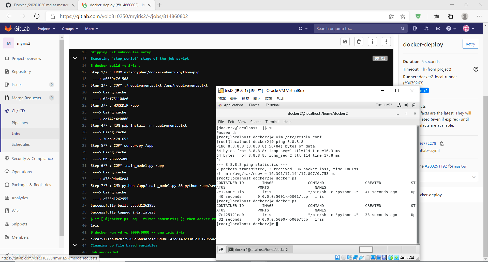

## 第七周上課

**實驗**  
- 編輯Dockerfile
```
FROM nitincypher/docker-ubuntu-python-pip

COPY ./requirements.txt /app/requirements.txt

WORKDIR /app

RUN pip install -r requirements.txt

COPY server.py /app

COPY train_model.py /app

CMD python /app/train_model.py && python /app/server.py
```
- 編輯requirements.txt
```
flask
sklearn
```
- 運行
```
docker build -t iris:1.0 .

docker run -itd -p 5000:5000 iris:1.0
```

- ssh key放上git lab
```
ssh-keygen
cd .ssh
cat /root/.ssh/id_rsa.pub
```
將ssh key複製到此處


- 推上GITLAB
    - 先在gitlab創建一個myiris的project
```
git config --global user.name "yolo310250"
git config --global user.email "monster113080@gmail.com"
git init
git remote add origin git@gitlab.com:yolo310250/myiris.git
git add .
git commit -m "Initial commit"
git push -u origin master
```

- 在第二台虛擬機安裝gitlab-runner
[參考網址](https://docs.gitlab.com/runner/install/linux-manually.html)  
```
sudo curl -L --output /usr/local/bin/gitlab-runner https://gitlab-runner-downloads.s3.amazonaws.com/latest/binaries/gitlab-runner-linux-amd64

chmod +x /usr/local/bin/gitlab-runner

useradd --comment 'GitLab Runner' --create-home gitlab-runner --shell /bin/bash

usermod -aG docker gitlab-runner

gitlab-runner install --user=gitlab-runner --working-directory=/home/gitlab-runner

gitlab-runner start
```
- 運行gitlab-runner


- 自動化  
    - 在第一台虛擬機編輯.gitlab-ci.yml
 ```
    stages:
  - deploy

docker-deploy:
  stage: deploy
  script: 
    - docker build -t iris .
    - if [ $(docker ps -aq --filter name=iris) ]; then docker rm -f iris; fi
    - docker run -d -p 5000:5000 --name iris iris
  tags:
    - docker2
```
```
git add .gitlab-ci.yml
git commit -m "submit .gitlab-ci.yml"
git push -u origin master
```

**成功完成自動化部屬**
