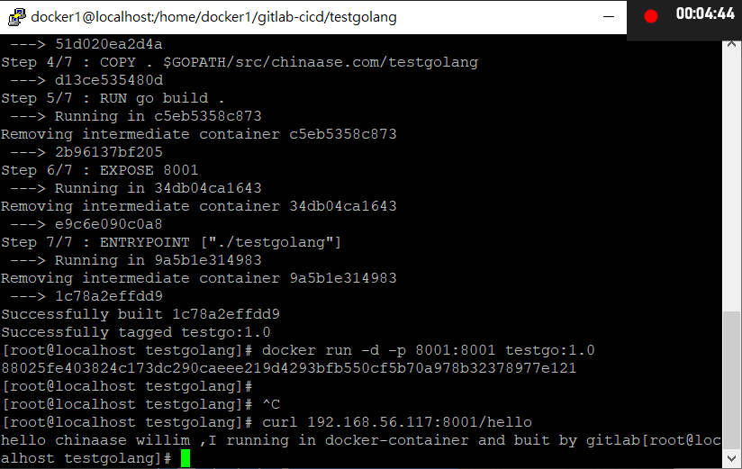
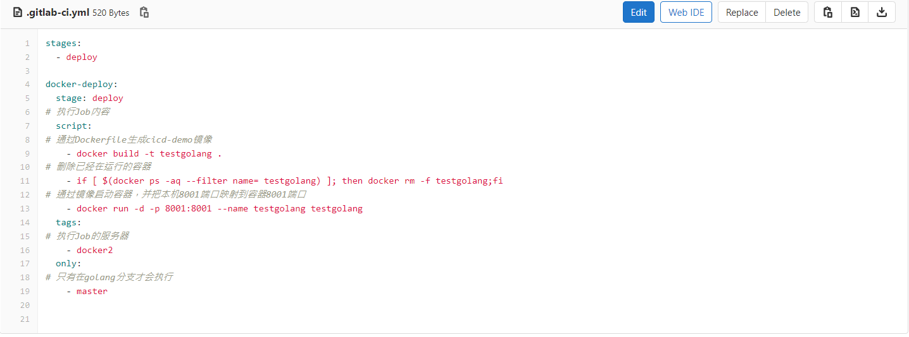
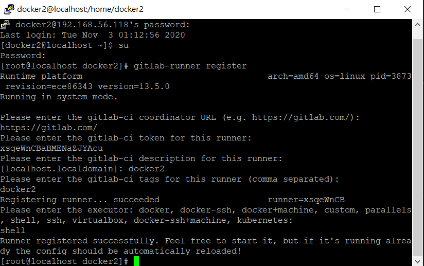
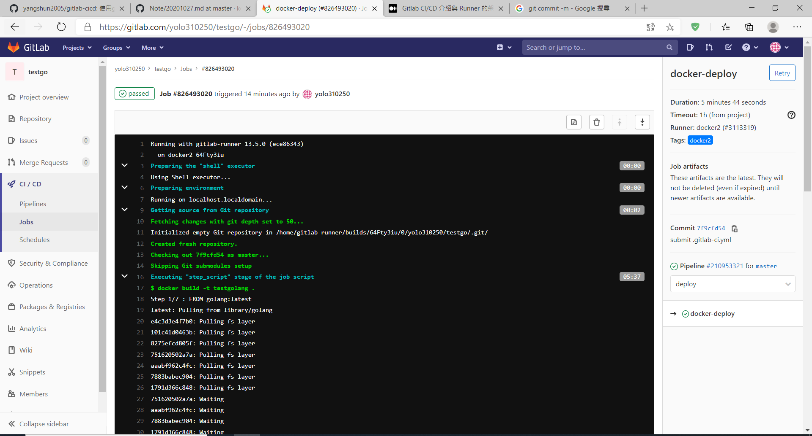
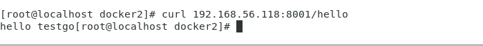

## 第八週上課
**gitlab-cicd**
[參考網頁](https://github.com/yangshun2005/gitlab-cicd)
```
git clone https://github.com/yangshun2005/gitlab-cicd.git
cd gitlab-cicd/
cd testgolang/

docker build -t testgo:1.0 .

docker run -d -p 8001:8001 testgo:1.0

curl 192.168.157.136:8001/hello
```
成功 
**實驗**  
- 在gitlab上create testgo project
    - 推上GITLAB
```
git init
git remote add origin git@gitlab.com:yolo310250/testgo.git
git add .
git commit -m "Initial commit"
git push -u origin master
```
- 修改.gitlab-ci.yml

```
git add .gitlab-ci.yml
git commit -m "submit a modified .gitlab-ci.yml"
git push -u origin master
```
- 第二台虛擬機執行gitlab-runner

- 修改main.go中的訊息欄位
```
git add main.go
git commit -m "modified main.go"
git push -u origin master
```

便能在CI-CD的Jobs看到在運行中


Job succeeded後就能在docker2看到


網頁伺服器
連上後會計次
curl 127.0.0.1:5000