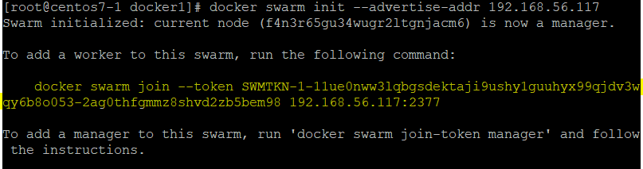

## 第十周上課

**Docker Swarm**
- 準備三台虛擬機
    - 修改hostname `hostnamectl set-hostname centos7-x`
    - vim /etc/hosts `ip hostname`
- 以centos7-1為manager  
`docker swarm init --advertise-addr 192.168.56.117`
    - centos7-2及7-3則複製下方指令
    

- Visualizer  
    - `docker pull dockersamples/visualizer`  
    - `docker run -itd -p 8888:8080 -e HOST=192.168.56.117  -e PORT=8080 -v /var/run/docker.sock:/var/run/docker.sock --name visualizer dockersamples/visualizer`

- service discovery