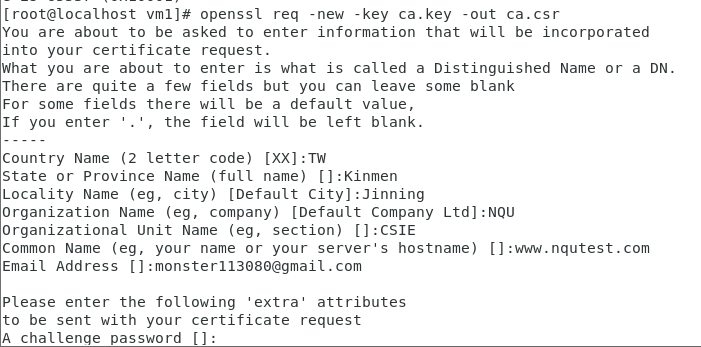

# Centos ssl憑證

```
Step1:yum install mod_ssl openssl

Step2:openssl genrsa -out ca.key 2048

Step3:openssl req -new -key ca.key -out ca.csr
```

```
Step4: openssl x509 -req -days 3650 -in ca.csr -signkey ca.key -out ca.crt

Step5: mkdir -p /etc/myssl
	  cp ca.key ca.csr ca.crt /etc/myssl
	  sudo gedit  /etc/httpd/conf.d/ssl.conf

Step6: 修改設定值
SSLCertificateFile /etc/mySSL/ca.crt
SSLCertificateKeyFile /etc/mySSL/ca.key

systemctl restart httpd

Step7:修改C:\Windows\System32\drivers\etc中的host檔案
	192.168.56.109	www.nqutest.com
Step8:在瀏覽器中開啟 https://www.nqutest.com 大功告成
```