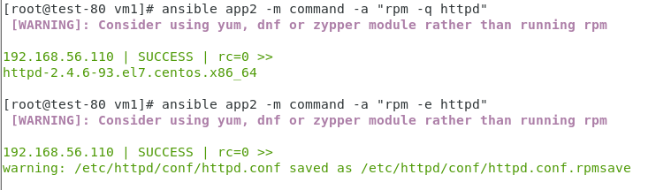
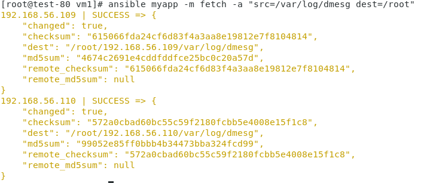

# 0429上課

- 使用VM1在VM2安裝HTTPD
先在VM2測試是否有安裝HTTPD
```
ansible app2 -m command -a "rpm -q httpd" (如果有就刪除)
ansible app2 -m command -a "rpm -e httpd" (刪除指令)
```

- 在app2安裝httpd
```
ansible app2 -m script -a install_httpd.sh
```

- 顯示群組為app1的httpd
```
ansible app1 -m yum -a "name=httpd status=present"
```
- 進行移除 httpd 套件
```
ansible app1 -m yum -a "name=httpd state=removed"
```
- 使用service module,啟動httpd並且開機會自動啟動
```
ansible app1 -m service -a "name=httpd state=started enabled=yes"  
```
- 重新啟動httpd服務
```
ansible app1 -m command -a "systemctl status httpd"
ansible app1 -m service -a "name=httpd state=restarted"
```

- fetch
```
yum install tree
ansible myapp -m fetch -a "src=/var/log/dmesg dest=/root"
```

