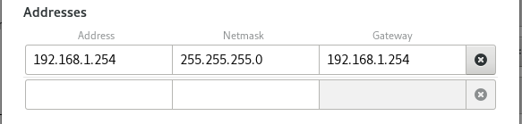
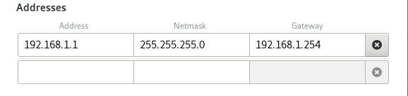
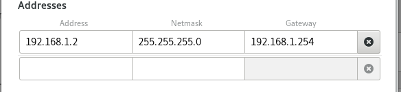
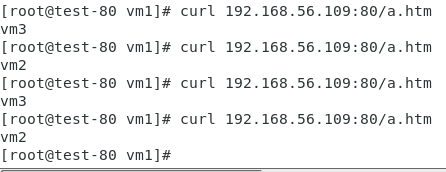

# 0527上課

## 負載均衡器
先準備3台虛擬機 \
第一台需要有3張網路卡 \
	1. NAT \
	2. Hostonly \
 	3. 內部網路(配置如下圖)

第二第三只需有內部網路即可


能夠互相PING到IP就成功了

到centos 7-1, 7-2上確認httpd是否啟動
```
systemctl status httpd

cd /var/www/html

echo "centos7-1" > a.htm

echo "centos7-2" > a.htm
```
到centos7上 (LB)
```
yum install ipvsadm -y

modprobe ip_vs

載入ipvs到核心中

ipvsadm -L  list規則

echo 1 > /proc/sys/net/ipv4/ip_forward

啟動路由功能

vim /etc/sysctl.conf

net.ipv4.ip_forward = 1

[root@centos7 user]# sysctl -p
net.ipv4.ip_forward = 1
```



