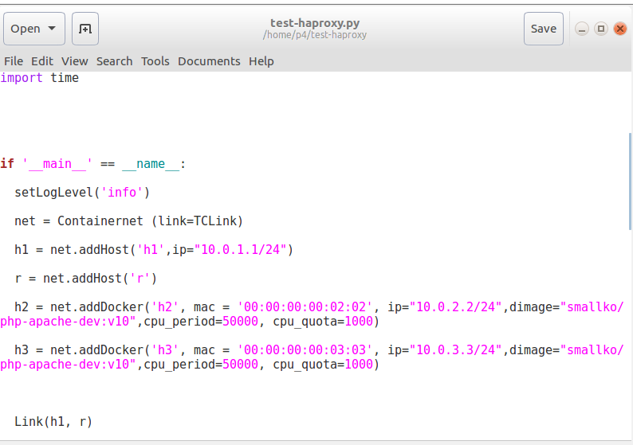
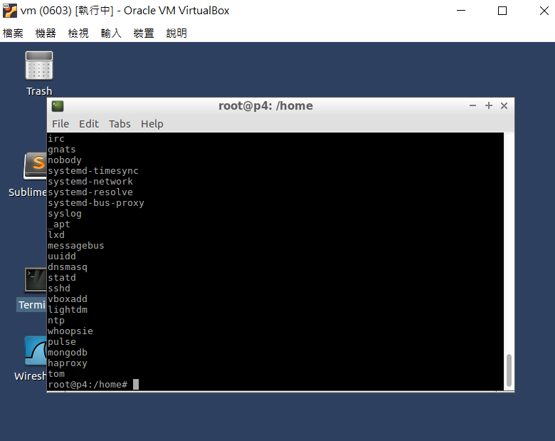

# 0610上課
```
 mycurl.sh 
 python test-lvs-nat-rr.py
 h1 cul 10.0.1.254/a.htm
 h1 bash mycurl.sh
```
另一個terminal
```
Docker ps
Docker exec -it mn.h2 bash
Netstat -tunlp | grep 80
Kill -9 數字
 wc -l /tmp/ok.txt 
```


Haproxy \
複製test-haproxy.py跟haproxy.cfg進虛擬機

改dimage
```
python test-haproxy.py
xterm r
```

- 請列出linux系統下的系統帳戶名稱

cat /etc/passwd | grep -v "/bin/bash" | awk -F: '{print $1}'



```
sed -i '20d' a.txt

sed -i '10,20d' a.txt

sed -i '/^ntp/d' a.txt

sed -i '10,/^user/d' a.txt
```
