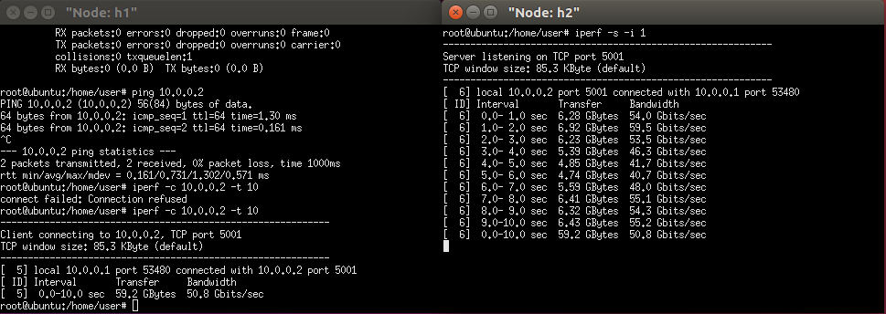
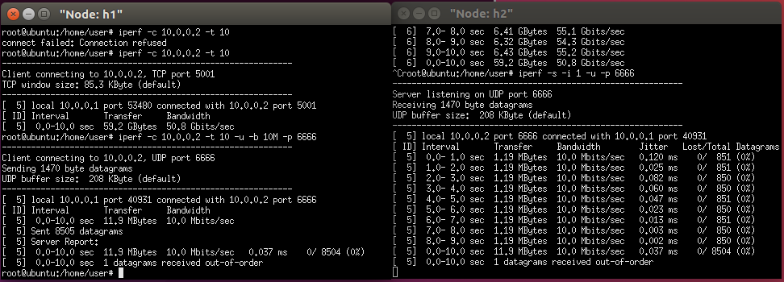

## Mininet

### Mininet指令

- `mn`:建構出mininet最基本的虛擬拓樸
- `net`:查看拓樸連接狀況
- `xterm`:開啟終端機
- `exit`:離開mininet

### 簡易效能測試

- h1
    - `iperf -c 10.0.0.2 -t 10`:傳輸10秒封包給10.0.0.2
- h2
    - `iperf -s -i 1`:TCP監測流量

- `iperf -s -i 1 -p 5555`:指定埠號

- h1
    - `iperf -c 10.0.0.2 -t 10 -u -b 10M -p 6666`:傳輸10M封包給10.0.0.2

- h2
    - `iperf -s -i 1 -u -p 6666`:udp監測流量

