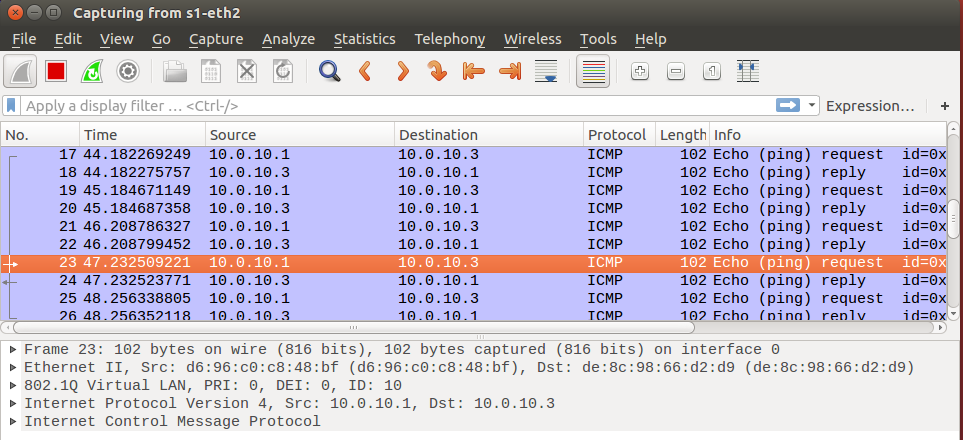
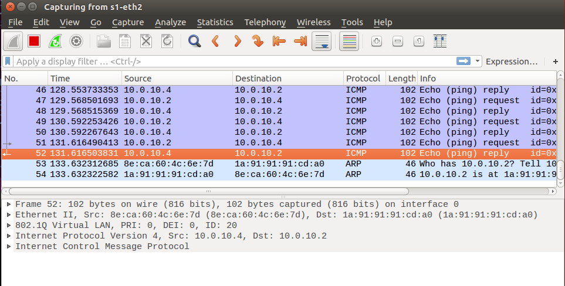
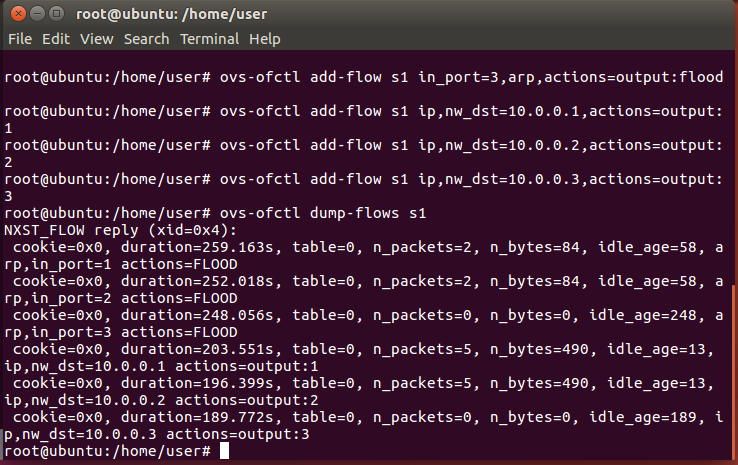

## 03-29上課

### 單臂路由1
- 5.py
```
#!/usr/bin/env python
from mininet.net import Mininet
from mininet.cli import CLI
from mininet.link import Link,TCLink,Intf

if 'main' == name:
  net = Mininet(link=TCLink)
  #h1 is under vlan10
  h1 = net.addHost('h1')
  #h2 is under vlan20
  h2 = net.addHost('h2')
  #h3 is under vlan10
  h3 = net.addHost('h3')
  #h4 is under vlan20
  h4 = net.addHost('h4')
  #s1 is a switch
  s1 = net.addHost('s1')
  #s2 is a switch
  s2 = net.addHost('s2')
  
  Link(h1, s1)
  Link(h2, s1)
  Link(h3, s2)
  Link(h4, s2)
  Link(s1, s2)
  net.build()
  
  s1.cmd("ifconfig s1-eth0 0")
  s1.cmd("ifconfig s1-eth1 0")
  s1.cmd("ifconfig s1-eth2 0")
  s2.cmd("ifconfig s2-eth0 0")
  s2.cmd("ifconfig s2-eth1 0")
  s2.cmd("ifconfig s2-eth2 0")
  s1.cmd("vconfig add s1-eth2 10")
  s1.cmd("vconfig add s1-eth2 20")
  s2.cmd("vconfig add s2-eth2 10")
  s2.cmd("vconfig add s2-eth2 20")
  s1.cmd("ifconfig s1-eth2.10 up")
  s1.cmd("ifconfig s1-eth2.20 up")
  s2.cmd("ifconfig s2-eth2.10 up")
  s2.cmd("ifconfig s2-eth2.20 up")
  s1.cmd("brctl addbr brvlan10")
  s1.cmd("brctl addbr brvlan20")
  s1.cmd("brctl addif brvlan10 s1-eth0")
  s1.cmd("brctl addif brvlan20 s1-eth1")
  s1.cmd("brctl addif brvlan10 s1-eth2.10")
  s1.cmd("brctl addif brvlan20 s1-eth2.20")
  s2.cmd("brctl addbr brvlan10")
  s2.cmd("brctl addbr brvlan20")
  s2.cmd("brctl addif brvlan10 s2-eth0")
  s2.cmd("brctl addif brvlan20 s2-eth1")
  s2.cmd("brctl addif brvlan10 s2-eth2.10")
  s2.cmd("brctl addif brvlan20 s2-eth2.20")
  s1.cmd("ifconfig brvlan10 up")
  s1.cmd("ifconfig brvlan20 up")
  s2.cmd("ifconfig brvlan10 up")
  s2.cmd("ifconfig brvlan20 up")
  h1.cmd("ifconfig h1-eth0 10.0.10.1 netmask 255.255.255.0")
  h2.cmd("ifconfig h2-eth0 10.0.10.2 netmask 255.255.255.0")
  h3.cmd("ifconfig h3-eth0 10.0.10.3 netmask 255.255.255.0")
  h4.cmd("ifconfig h4-eth0 10.0.10.4 netmask 255.255.255.0")
  CLI(net)
  net.stop()
```
- mininet
  - s1抓取s1-eth2網路
  - h1 ping h3
  
  
  - h2 ping h4

  
### 單臂路由2
- 6.py
```
#!/usr/bin/env python
from mininet.net import Mininet
from mininet.cli import CLI
from mininet.link import Link,TCLink,Intf

if 'main' == name:
  net = Mininet(link=TCLink)
  #h1 is under vlan10
  h1 = net.addHost('h1')
  #h2 is under vlan20
  h2 = net.addHost('h2')
  #h3 is under vlan10
  h3 = net.addHost('h3')
  #h4 is under vlan20
  h4 = net.addHost('h4')
  #s1 is a switch
  s1 = net.addHost('s1')
  #s2 is a switch
  s2 = net.addHost('s2')
  #s3 is a switch
  s3 = net.addHost('s3')
  #r1 is a router
  r1 = net.addHost('r1')
  
  Link(h1, s1)
  Link(h2, s1)
  Link(h3, s2)
  Link(h4, s2)
  Link(s1, s3)
  Link(s2, s3)
  Link(s3, r1)
  net.build()
  
  s1.cmd("ifconfig s1-eth0 0")
  s1.cmd("ifconfig s1-eth1 0")
  s1.cmd("ifconfig s1-eth2 0")
  s2.cmd("ifconfig s2-eth0 0")
  s2.cmd("ifconfig s2-eth1 0")
  s2.cmd("ifconfig s2-eth2 0")
  s3.cmd("ifconfig s3-eth0 0")
  s3.cmd("ifconfig s3-eth1 0")
  s3.cmd("ifconfig s3-eth2 0")
  r1.cmd("ifconfig r1-eth1 0")
  s1.cmd("vconfig add s1-eth2 10")
  s1.cmd("vconfig add s1-eth2 20")
  s2.cmd("vconfig add s2-eth2 10")
  s2.cmd("vconfig add s2-eth2 20")
  s3.cmd("vconfig add s3-eth0 10")
  s3.cmd("vconfig add s3-eth0 20")
  s3.cmd("vconfig add s3-eth1 10")
  s3.cmd("vconfig add s3-eth1 20")
  s3.cmd("vconfig add s3-eth2 10")
  s3.cmd("vconfig add s3-eth2 20")
  r1.cmd("vconfig add r1-eth0 10")
  r1.cmd("vconfig add r1-eth0 20")
  s1.cmd("ifconfig s1-eth2.10 up")
  s1.cmd("ifconfig s1-eth2.20 up")
  s2.cmd("ifconfig s2-eth2.10 up")
  s2.cmd("ifconfig s2-eth2.20 up")
  s3.cmd("ifconfig s3-eth0.10 up")
  s3.cmd("ifconfig s3-eth0.20 up")
  s3.cmd("ifconfig s3-eth1.10 up")
  s3.cmd("ifconfig s3-eth1.20 up")
  s3.cmd("ifconfig s3-eth2.10 up")
  s3.cmd("ifconfig s3-eth2.20 up")
  r1.cmd("ifconfig r1-eth0.10 up")
  r1.cmd("ifconfig r1-eth0.20 up")
  s1.cmd("brctl addbr brvlan10")
  s1.cmd("brctl addbr brvlan20")
  s1.cmd("brctl addif brvlan10 s1-eth0")
  s1.cmd("brctl addif brvlan20 s1-eth1")
  s1.cmd("brctl addif brvlan10 s1-eth2.10")
  s1.cmd("brctl addif brvlan20 s1-eth2.20")
  s2.cmd("brctl addbr brvlan10")
  s2.cmd("brctl addbr brvlan20")
  s2.cmd("brctl addif brvlan10 s2-eth0")
  s2.cmd("brctl addif brvlan20 s2-eth1")
  s2.cmd("brctl addif brvlan10 s2-eth2.10")
  s2.cmd("brctl addif brvlan20 s2-eth2.20")
  s3.cmd("brctl addbr brvlan10")
  s3.cmd("brctl addbr brvlan20")
  s3.cmd("brctl addif brvlan10 s3-eth0.10")
  s3.cmd("brctl addif brvlan10 s3-eth1.10")
  s3.cmd("brctl addif brvlan10 s3-eth2.10")
  s3.cmd("brctl addif brvlan20 s3-eth0.20")
  s3.cmd("brctl addif brvlan20 s3-eth1.20")
  s3.cmd("brctl addif brvlan20 s3-eth2.20")  
  s1.cmd("ifconfig brvlan10 up")
  s1.cmd("ifconfig brvlan20 up")
  s2.cmd("ifconfig brvlan10 up")
  s2.cmd("ifconfig brvlan20 up")
  s3.cmd("ifconfig brvlan10 up")
  s3.cmd("ifconfig brvlan20 up")
  r1.cmd('ifconfig r1-eth0.10 192.168.10.254 netmask 255.255.255.0')
  r1.cmd('ifconfig r1-eth0.20 192.168.20.254 netmask 255.255.255.0')
  r1.cmd("echo 1 > /proc/sys/net/ipv4/ip_forward")
  h1.cmd("ifconfig h1-eth0 192.168.10.1 netmask 255.255.255.0")
  h1.cmd("ip route add default via 192.168.10.254")
  h2.cmd("ifconfig h2-eth0 192.168.20.1 netmask 255.255.255.0")
  h2.cmd("ip route add default via 192.168.20.254")
  h3.cmd("ifconfig h3-eth0 192.168.10.2 netmask 255.255.255.0")
  h3.cmd("ip route add default via 192.168.10.254")
  h4.cmd("ifconfig h4-eth0 192.168.20.2 netmask 255.255.255.0")
  h4.cmd("ip route add default via 192.168.20.254")
  CLI(net)
  net.stop()
```
### hub
```
#!/usr/bin/env python
from mininet.cli import CLI
from mininet.net import Mininet
from mininet.link import Link,TCLink,Intf
 
if '__main__' == __name__:
  net = Mininet(link=TCLink)
  h1 = net.addHost('h1', mac='00:00:00:00:01:00')
  h2 = net.addHost('h2', mac='00:00:00:00:02:00')
  h3 = net.addHost('h3', mac='00:00:00:00:03:00')
  h4 = net.addHost('h4', mac='00:00:00:00:04:00')
  Link(h1, h4)
  Link(h2, h4)
  Link(h3, h4)
  net.build()
  h4.cmd("ifconfig h4-eth0 0")
  h4.cmd("ifconfig h4-eth1 0")
  h4.cmd("ifconfig h4-eth2 0")
  h4.cmd("brctl addbr br0")
  h4.cmd("brctl addif br0 h4-eth0")
  h4.cmd("brctl addif br0 h4-eth1")
  h4.cmd("brctl addif br0 h4-eth2")
  h4.cmd("brctl setageing br0 0")
  h4.cmd("ifconfig br0 up")
  CLI(net)
  net.stop()

```

### 手動控制openvswitch

