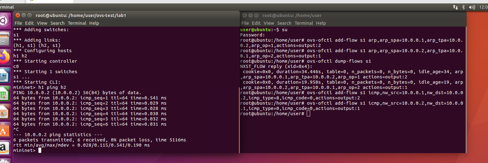
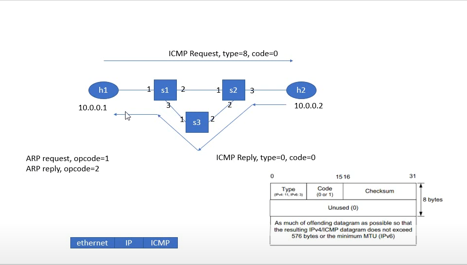
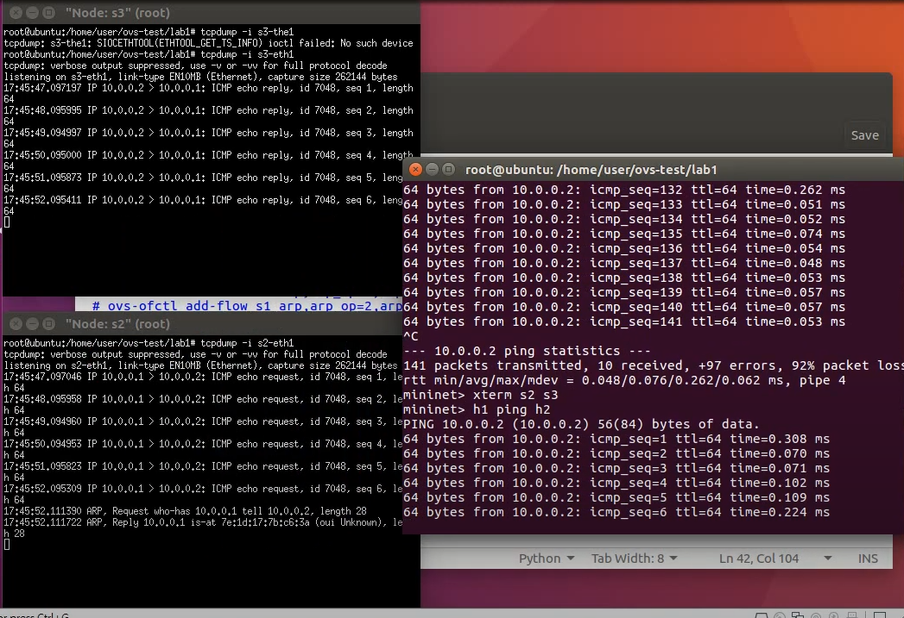
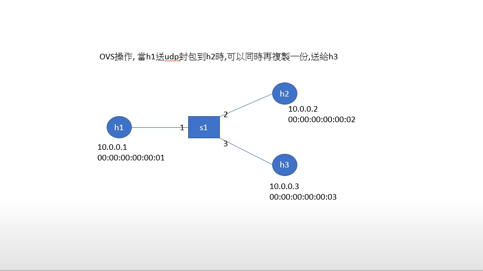
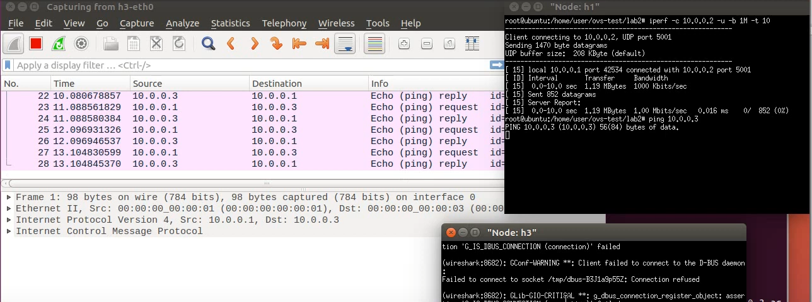

## Openvswitch


### 手動設置規則

`mn --controller=remote`:controller設成remote需自訂規則

- 設定arp規則
```
ovs-ofctl add-flow s1 arp,arp_spa=10.0.0.1,arp_tpa=10.0.0.2,arp_op=1,actions=output:2
ovs-ofctl add-flow s1 arp,arp_spa=10.0.0.2,arp_tpa=10.0.0.1,arp_op=2,actions=output:1
```
- 測試  
`h1 ping h2 -c 1`

- 設定icmp規則
```
ovs-ofctl add-flow s1 icmp,nw_src=10.0.0.1,nw_dst=10.0.0.2,icmp_type=8,icmp_code=0,actions=output:2
ovs-ofctl add-flow s1 icmp,nw_src=10.0.0.2,nw_dst=10.0.0.1,icmp_type=0,icmp_code=0,actions=output:1
```




### ping request與reply分開



- lab1.py
```
#!/usr/bin/env python
from mininet.cli import CLI
from mininet.net import Mininet
from mininet.link import Link,TCLink,Intf
from mininet.node import Controller,RemoteController

if '__main__' == __name__:
  net = Mininet(link=TCLink)
  h1 = net.addHost('h1')
  h2 = net.addHost('h2')
  s1 = net.addSwitch('s1')
  s2 = net.addSwitch('s2')
  s3 = net.addSwitch('s3')
  c0 = net.addController('c0', controller=RemoteController)
  net.addLink(h1, s1)
  net.addLink(s1, s2)
  net.addLink(s1, s3)
  net.addLink(s3, s2)
  net.addLink(s2, h2)
  net.build()
  c0.start()
  s1.start([c0])
  s2.start([c0])
  s3.start([c0])
  # rules for s1
  s1.cmd("ovs-ofctl add-flow s1 arp,arp_op=1,arp_spa=10.0.0.1,arp_tpa=10.0.0.2,actions=output:2")
  s1.cmd("ovs-ofctl add-flow s1 arp,arp_op=1,arp_spa=10.0.0.2,arp_tpa=10.0.0.1,actions=output:1")
  s1.cmd("ovs-ofctl add-flow s1 arp,arp_op=2,arp_spa=10.0.0.1,arp_tpa=10.0.0.2,actions=output:2")
  s1.cmd("ovs-ofctl add-flow s1 arp,arp_op=2,arp_spa=10.0.0.2,arp_tpa=10.0.0.1,actions=output:1")
  s1.cmd("ovs-ofctl add-flow s1 icmp,nw_src=10.0.0.1,nw_dst=10.0.0.2,icmp_type=8,icmp_code=0,actions=output:2")
  s1.cmd("ovs-ofctl add-flow s1 icmp,nw_src=10.0.0.2,nw_dst=10.0.0.1,icmp_type=8,icmp_code=0,actions=output:1")
  s1.cmd("ovs-ofctl add-flow s1 icmp,nw_src=10.0.0.1,nw_dst=10.0.0.2,icmp_type=0,icmp_code=0,actions=output:2")
  s1.cmd("ovs-ofctl add-flow s1 icmp,nw_src=10.0.0.2,nw_dst=10.0.0.1,icmp_type=0,icmp_code=0,actions=output:1")

  # rules for s2
  s2.cmd("ovs-ofctl add-flow s2 arp,arp_op=1,arp_spa=10.0.0.1,arp_tpa=10.0.0.2,actions=output:3")
  s2.cmd("ovs-ofctl add-flow s2 arp,arp_op=1,arp_spa=10.0.0.2,arp_tpa=10.0.0.1,actions=output:1")
  s2.cmd("ovs-ofctl add-flow s2 arp,arp_op=2,arp_spa=10.0.0.1,arp_tpa=10.0.0.2,actions=output:3")
  s2.cmd("ovs-ofctl add-flow s2 arp,arp_op=2,arp_spa=10.0.0.2,arp_tpa=10.0.0.1,actions=output:1")
  s2.cmd("ovs-ofctl add-flow s2 icmp,nw_src=10.0.0.1,nw_dst=10.0.0.2,icmp_type=8,icmp_code=0,actions=output:3")
  s2.cmd("ovs-ofctl add-flow s2 icmp,nw_src=10.0.0.2,nw_dst=10.0.0.1,icmp_type=8,icmp_code=0,actions=output:2")
  s2.cmd("ovs-ofctl add-flow s2 icmp,nw_src=10.0.0.1,nw_dst=10.0.0.2,icmp_type=0,icmp_code=0,actions=output:3")
  s2.cmd("ovs-ofctl add-flow s2 icmp,nw_src=10.0.0.2,nw_dst=10.0.0.1,icmp_type=0,icmp_code=0,actions=output:2")

  # rules for s3
  s3.cmd("ovs-ofctl add-flow s3 icmp,nw_src=10.0.0.2,nw_dst=10.0.0.1,icmp_type=0,icmp_code=0,actions=output:1")
  s3.cmd("ovs-ofctl add-flow s3 icmp,nw_src=10.0.0.2,nw_dst=10.0.0.1,icmp_type=8,icmp_code=0,actions=output:1")

  CLI(net)
  net.stop()

```
- 測試
    - s2
        - `tcpdump -i s2-eth1`
    - s3
        - `tcpdump -i s3-eth1`    
    - mininet
        - `h1 ping h2`



### mirror function



- mirror.py
```
#!/usr/bin/env python
from mininet.cli import CLI
from mininet.net import Mininet
from mininet.link import Link,TCLink,Intf
from mininet.node import Controller,RemoteController

if '__main__' == __name__:
  net = Mininet(link=TCLink)

  # 在新增節點的時候，設定 IP 和 MAC Address
  h1 = net.addHost('h1', ip="10.0.0.1/24", mac="00:00:00:00:00:01")
  h2 = net.addHost('h2', ip="10.0.0.2/24", mac="00:00:00:00:00:02")
  h3 = net.addHost('h3', ip="10.0.0.3/24", mac="00:00:00:00:00:03")
  s1 = net.addSwitch('s1')
  c0 = net.addController('c0', controller=RemoteController)
  net.addLink(h1, s1)
  net.addLink(h2, s1)
  net.addLink(h3, s1)
  net.build()
  c0.start()
  s1.start([c0])
  h1.cmd("arp -s 10.0.0.2 00:00:00:00:00:02")
  h1.cmd("arp -s 10.0.0.3 00:00:00:00:00:03")
  h2.cmd("arp -s 10.0.0.1 00:00:00:00:00:01")
  h2.cmd("arp -s 10.0.0.3 00:00:00:00:00:03")
  h3.cmd("arp -s 10.0.0.1 00:00:00:00:00:01")
  h3.cmd("arp -s 10.0.0.2 00:00:00:00:00:02")

  CLI(net)
  net.stop()
```
- ubuntu `
    - `ovs-ofctl dump-flows s1`
    - 新增規則
      ```
      ovs-ofctl add-flow s1 priority=1,ip,nw_dst=10.0.0.1,actions=output:1
      ovs-ofctl add-flow s1 priority=1,ip,nw_dst=10.0.0.2,actions=output:2
      ovs-ofctl add-flow s1 priority=1,ip,nw_dst=10.0.0.3,actions=output:3
      ovs-ofctl add-flow s1 priority=10,ip,nw_src=10.0.0.1,nw_dst=10.0.0.2,actions=output:2,output:3
      ```
    - pingall可成功

- 測試
    - h3
        - 開啟wireshark-h3-eth0
    - h2
        - iperf -s -i 1 -u
    - h1
        - iperf -c 10.0.0.2 -u -b 1M -t 10
#### 發現h3未收到封包

- 解決
    - 刪除`ovs-ofctl del-flows s1 udp,nw_src=10.0.0.1,nw_dst=10.0.0.2`
    - 新增`ovs-ofctl add-flow s1 priority=10,udp,nw_src=10.0.0.1,nw_dst=10.0.0.2`

#### 當h1送封包到h2時h3也能接收到封包


- mirror2.py
```
#!/usr/bin/env python
from mininet.cli import CLI
from mininet.net import Mininet
from mininet.link import Link,TCLink,Intf
from mininet.node import Controller,RemoteController

if '__main__' == __name__:
  net = Mininet(link=TCLink)
  h1 = net.addHost('h1', ip="10.0.0.1/24", mac="00:00:00:00:00:01")
  h2 = net.addHost('h2', ip="10.0.0.2/24", mac="00:00:00:00:00:02")
  h3 = net.addHost('h3', ip="10.0.0.3/24", mac="00:00:00:00:00:03")
  s1 = net.addSwitch('s1')
  c0 = net.addController('c0', controller=RemoteController)
  net.addLink(h1, s1)
  net.addLink(h2, s1)
  net.addLink(h3, s1)
  net.build()
  c0.start()
  s1.start([c0])
  h1.cmd("arp -s 10.0.0.2 00:00:00:00:00:02")
  h1.cmd("arp -s 10.0.0.3 00:00:00:00:00:03")
  h2.cmd("arp -s 10.0.0.1 00:00:00:00:00:01")
  h2.cmd("arp -s 10.0.0.3 00:00:00:00:00:03")
  h3.cmd("arp -s 10.0.0.1 00:00:00:00:00:01")
  h3.cmd("arp -s 10.0.0.2 00:00:00:00:00:02")
  #rules for s1
  s1.cmd("ovs-ofctl add-flow s1 priority=1,ip,nw_dst=10.0.0.1,actions=output:1")
  s1.cmd("ovs-ofctl add-flow s1 priority=1,ip,nw_dst=10.0.0.2,actions=output:2")
  s1.cmd("ovs-ofctl add-flow s1 priority=1,ip,nw_dst=10.0.0.3,actions=output:3")
  s1.cmd("ovs-ofctl add-flow s1 priority=10,udp,nw_dst=10.0.0.2,actions=output:2,mod_dl_dst=00:00:00:00:00:03,mod_nw_dst=10.0.0.3,output:3")
  CLI(net)
  net.stop()
```
- block h3 的封包

    - `ovs-ofctl add-flow s1 priority=100,ip,nw_src=10.0.0.3,actions=drop`
- 測試
    - h3的wireshark查看h3-eth0



可以觀察到 h1 有 ping request、h3 有 ping reply，但 h1 不會接收到 10.0.0.3 的 reply