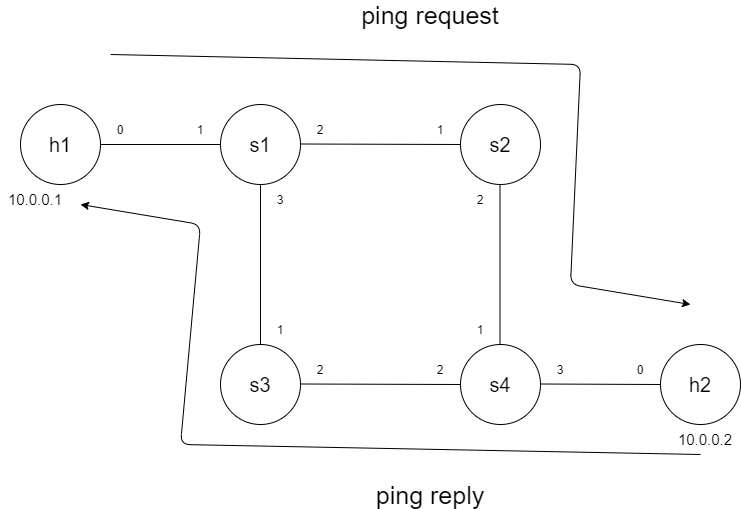
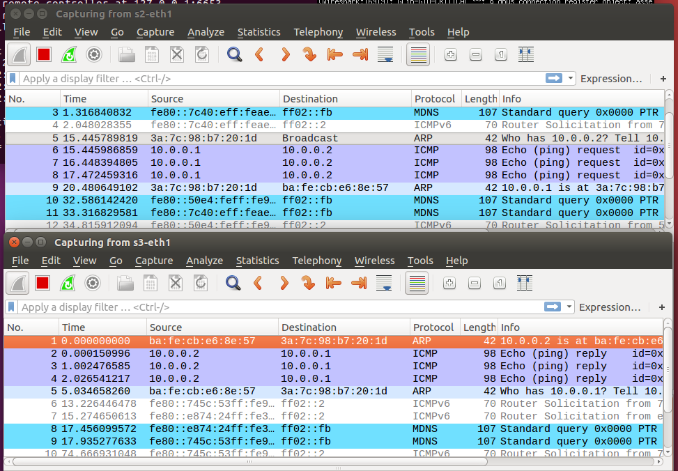

## 期中作業



- CODE
```
#!/usr/bin/env python
from mininet.cli import CLI
from mininet.net import Mininet
from mininet.link import Link,TCLink,Intf
from mininet.node import Controller,RemoteController

if '__main__' == __name__:
  net = Mininet(link=TCLink)
  h1 = net.addHost('h1')
  h2 = net.addHost('h2')
  s1 = net.addSwitch('s1')
  s2 = net.addSwitch('s2')
  s3 = net.addSwitch('s3')
  s4 = net.addSwitch('s4')
  c0 = net.addController('c0', controller=RemoteController)
  net.addLink(h1, s1)
  net.addLink(h2, s4)
  net.addLink(s1, s2)
  net.addLink(s1, s3)
  net.addLink(s2, s4)
  net.addLink(s3, s4)
  net.build()
  c0.start()
  s1.start([c0])
  s2.start([c0])
  s3.start([c0])
  s4.start([c0])
  # rules for s1
  s1.cmd("ovs-ofctl add-flow s1 arp,arp_op=1,arp_spa=10.0.0.1,arp_tpa=10.0.0.2,actions=output:2")
  s1.cmd("ovs-ofctl add-flow s1 arp,arp_op=1,arp_spa=10.0.0.2,arp_tpa=10.0.0.1,actions=output:1")
  s1.cmd("ovs-ofctl add-flow s1 arp,arp_op=2,arp_spa=10.0.0.1,arp_tpa=10.0.0.2,actions=output:2")
  s1.cmd("ovs-ofctl add-flow s1 arp,arp_op=2,arp_spa=10.0.0.2,arp_tpa=10.0.0.1,actions=output:1")
  s1.cmd("ovs-ofctl add-flow s1 icmp,nw_src=10.0.0.1,nw_dst=10.0.0.2,icmp_type=8,icmp_code=0,actions=output:2")
  s1.cmd("ovs-ofctl add-flow s1 icmp,nw_src=10.0.0.2,nw_dst=10.0.0.1,icmp_type=8,icmp_code=0,actions=output:1")
  s1.cmd("ovs-ofctl add-flow s1 icmp,nw_src=10.0.0.1,nw_dst=10.0.0.2,icmp_type=0,icmp_code=0,actions=output:2")
  s1.cmd("ovs-ofctl add-flow s1 icmp,nw_src=10.0.0.2,nw_dst=10.0.0.1,icmp_type=0,icmp_code=0,actions=output:1")

  # rules for s2
  s2.cmd("ovs-ofctl add-flow s2 arp,arp_op=1,arp_spa=10.0.0.1,arp_tpa=10.0.0.2,actions=output:2")
  s2.cmd("ovs-ofctl add-flow s2 arp,arp_op=2,arp_spa=10.0.0.1,arp_tpa=10.0.0.2,actions=output:2")
  s2.cmd("ovs-ofctl add-flow s2 icmp,nw_src=10.0.0.1,nw_dst=10.0.0.2,icmp_type=8,icmp_code=0,actions=output:2")
  s2.cmd("ovs-ofctl add-flow s2 icmp,nw_src=10.0.0.1,nw_dst=10.0.0.2,icmp_type=0,icmp_code=0,actions=output:2")

  # rules for s3
  s3.cmd("ovs-ofctl add-flow s3 arp,arp_op=1,arp_spa=10.0.0.2,arp_tpa=10.0.0.1,actions=output:1")
  s3.cmd("ovs-ofctl add-flow s3 arp,arp_op=2,arp_spa=10.0.0.2,arp_tpa=10.0.0.1,actions=output:1")
  s3.cmd("ovs-ofctl add-flow s3  icmp,nw_src=10.0.0.2,nw_dst=10.0.0.1,icmp_type=8,icmp_code=0,actions=output:1")
  s3.cmd("ovs-ofctl add-flow s3 icmp,nw_src=10.0.0.2,nw_dst=10.0.0.1,icmp_type=0,icmp_code=0,actions=output:1")

  # rules for s4
  s4.cmd("ovs-ofctl add-flow s4 arp,arp_op=1,arp_spa=10.0.0.1,arp_tpa=10.0.0.2,actions=output:1")
  s4.cmd("ovs-ofctl add-flow s4 arp,arp_op=1,arp_spa=10.0.0.2,arp_tpa=10.0.0.1,actions=output:3")
  s4.cmd("ovs-ofctl add-flow s4 arp,arp_op=2,arp_spa=10.0.0.1,arp_tpa=10.0.0.2,actions=output:1")
  s4.cmd("ovs-ofctl add-flow s4 arp,arp_op=2,arp_spa=10.0.0.2,arp_tpa=10.0.0.1,actions=output:3")
  s4.cmd("ovs-ofctl add-flow s4 icmp,nw_src=10.0.0.1,nw_dst=10.0.0.2,icmp_type=8,icmp_code=0,actions=output:1")
  s4.cmd("ovs-ofctl add-flow s4 icmp,nw_src=10.0.0.2,nw_dst=10.0.0.1,icmp_type=8,icmp_code=0,actions=output:3")
  s4.cmd("ovs-ofctl add-flow s4 icmp,nw_src=10.0.0.1,nw_dst=10.0.0.2,icmp_type=0,icmp_code=0,actions=output:1")
  s4.cmd("ovs-ofctl add-flow s4 icmp,nw_src=10.0.0.2,nw_dst=10.0.0.1,icmp_type=0,icmp_code=0,actions=output:3")


  CLI(net)
  net.stop()
```
- 測試
    - mininet `h1 ping h2 -c 3`
    - s2 開啟wireshark查看s2-eth1
    - s3 開啟wireshark查看s3-eth1


