## Group Table
- 參考
    [深入OpenFlow協定 看Group Table設定流程](https://www.netadmin.com.tw/netadmin/zh-tw/technology/9FF6A417220F400884C788AB00FA3750)


### Group Table 
    - load balance (select)
    - fault tolerance 
    - mix 1 and 2

### Q1 

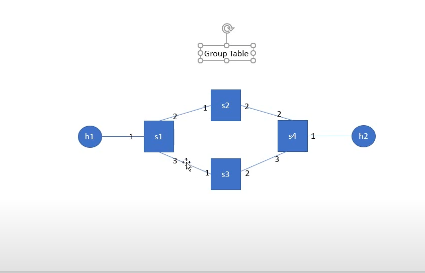


- group-select.py
```
from mininet.net import Mininet
from mininet.node import Controller, RemoteController, OVSKernelSwitch, UserSwitch, OVSSwitch
from mininet.cli import CLI
from mininet.log import setLogLevel
from mininet.link import Link, TCLink
 
def topology():
  net = Mininet( controller=RemoteController, link=TCLink, switch=OVSKernelSwitch)
 
  # Add hosts and switches
  h1 = net.addHost('h1', mac="00:00:00:00:00:01" )
  h2 = net.addHost('h2', mac="00:00:00:00:00:02" )
 
  s1 = net.addSwitch('s1', protocols=["OpenFlow10,OpenFlow13"], listenPort=6634 )
  s2 = net.addSwitch('s2', protocols=["OpenFlow10,OpenFlow13"], listenPort=6635 )
  s3 = net.addSwitch('s3', protocols=["OpenFlow10,OpenFlow13"], listenPort=6636 )
  s4 = net.addSwitch('s4', protocols=["OpenFlow10,OpenFlow13"], listenPort=6637 )
 
  c0 = net.addController('c0', controller=RemoteController, ip='127.0.0.1', port=6633 )
 
  net.addLink(h1, s1)
  net.addLink(h2, s4)
  net.addLink(s1, s2)
  net.addLink(s1, s3)
  net.addLink(s2, s4)
  net.addLink(s3, s4)
  net.build()
  c0.start()
  s1.start([c0])
  s2.start([c0])
  s3.start([c0])
  s4.start([c0])
 
  print "*** Running CLI"
  CLI(net)

  print "*** Stopping network"
  net.stop()

if __name__ == '__main__':
    setLogLevel('info')
    topology()
```

- script for setting up rules
```
ovs-ofctl -O OpenFlow13 add-flow s2 in_port=1,actions=output:2
ovs-ofctl -O OpenFlow13 add-flow s2 in_port=2,actions=output:1
ovs-ofctl -O OpenFlow13 add-flow s3 in_port=1,actions=output:2
ovs-ofctl -O OpenFlow13 add-flow s3 in_port=2,actions=output:1
ovs-ofctl -O OpenFlow13 add-flow s4 in_port=2,actions=output:1
ovs-ofctl -O OpenFlow13 add-flow s4 in_port=3,actions=output:1
ovs-ofctl -O OpenFlow13 add-flow s4 in_port=1,actions=output:3
ovs-ofctl -O OpenFlow13 add-flow s1 in_port=2,actions=output:1
ovs-ofctl -O OpenFlow13 add-flow s1 in_port=3,actions=output:1
ovs-ofctl -O OpenFlow13 add-group s1 group_id=5,type=select,bucket=output:2,bucket=output:3
ovs-ofctl -O OpenFlow13 add-flow s1 in_port=1,actions=group:5
```

- 執行
    - cmd1
        - `python group-select.py`
    - cmd2
        - `chmod +x rule.sh`
        - `./rule.sh`
    - cmd2 查看s1 port的狀況
        - `ovs-ofctl -O OpenFlow13 dump-ports s1`

- 測試tcp
    - ubuntu
        - `xterm h1 h2`
    - h1
        - `iperf -c 10.0.0.2 -t 100`
    - h2 
        - `iperf -s -i 1`

#### 先是PORT3改變
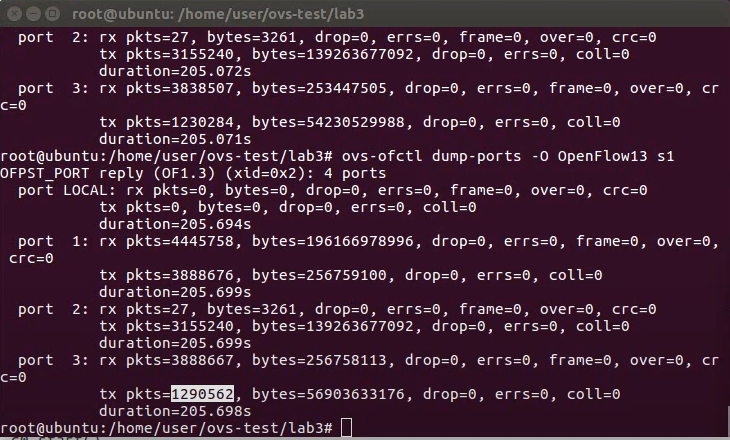

- 重複執行`iperf -c 10.0.0.2 -t 100`

#### 發現變PORT2改變
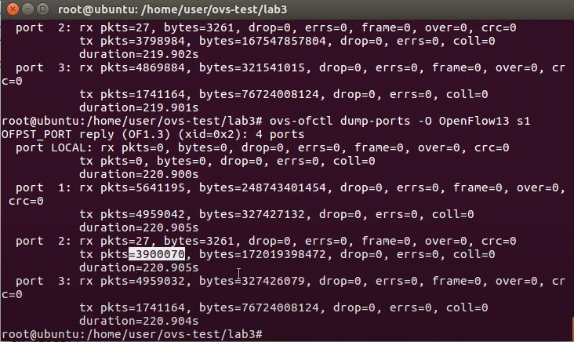


### Q2
#### 當port2出現問題，會自動切換成port3

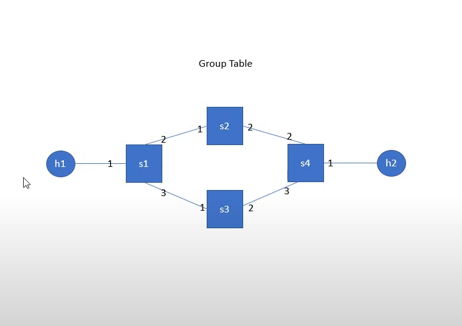

- fast-failover.py

```
from mininet.net import Mininet
from mininet.node import Controller, RemoteController, OVSKernelSwitch, UserSwitch, OVSSwitch
from mininet.cli import CLI
from mininet.log import setLogLevel
from mininet.link import Link, TCLink
 
def topology():
  net = Mininet( controller=RemoteController, link=TCLink, switch=OVSKernelSwitch)
 
  # Add hosts and switches
  h1 = net.addHost('h1', mac="00:00:00:00:00:01" )
  h2 = net.addHost('h2', mac="00:00:00:00:00:02" )
 
  s1 = net.addSwitch('s1', protocols=["OpenFlow10,OpenFlow13"], listenPort=6634 )
  s2 = net.addSwitch('s2', protocols=["OpenFlow10,OpenFlow13"], listenPort=6635 )
  s3 = net.addSwitch('s3', protocols=["OpenFlow10,OpenFlow13"], listenPort=6636 )
  s4 = net.addSwitch('s4', protocols=["OpenFlow10,OpenFlow13"], listenPort=6637 )
 
  c0 = net.addController('c0', controller=RemoteController, ip='127.0.0.1', port=6633 )
 
  net.addLink(h1, s1)
  net.addLink(h2, s4)
  net.addLink(s1, s2)
  net.addLink(s1, s3)
  net.addLink(s2, s4)
  net.addLink(s3, s4)
  net.build()
  c0.start()
  s1.start([c0])
  s2.start([c0])
  s3.start([c0])
  s4.start([c0])
 
  print "*** Running CLI"
  CLI(net)

  print "*** Stopping network"
  net.stop()

if __name__ == '__main__':
    setLogLevel('info')
    topology()
```

- rule.sh

```
ovs-ofctl -O OpenFlow13 add-flow s2 in_port=1,actions=output:2
ovs-ofctl -O OpenFlow13 add-flow s2 in_port=2,actions=output:1
ovs-ofctl -O OpenFlow13 add-flow s3 in_port=1,actions=output:2
ovs-ofctl -O OpenFlow13 add-flow s3 in_port=2,actions=output:1
ovs-ofctl -O OpenFlow13 add-flow s4 in_port=2,actions=output:1
ovs-ofctl -O OpenFlow13 add-flow s4 in_port=3,actions=output:1
ovs-ofctl -O OpenFlow13 add-flow s4 in_port=1,actions=output:3
ovs-ofctl -O OpenFlow13 add-flow s1 in_port=2,actions=output:1
ovs-ofctl -O OpenFlow13 add-flow s1 in_port=3,actions=output:1
ovs-ofctl -O OpenFlow13 add-group s1 group_id=4,type=ff,bucket=watch_port:2,output:2,bucket=watch_port:3,output:3
ovs-ofctl -O OpenFlow13 add-flow s1 in_port=1,actions=group:4
```

- 執行
    - cmd1
        - `python fast-failover.py`
    - cmd2
        - `chmod +x rule.sh`
        - `./rule.sh`
    - cmd2 查看s1 port的狀況
        - `ovs-ofctl -O OpenFlow13 dump-ports s1`

- 測試udp
    - h1
        - `iperf -c 10.0.0.2 -u -b 1M -t 100`
    - h2
        - `iperf -s -i 1 -u`

#### 發現只有PORT2改變
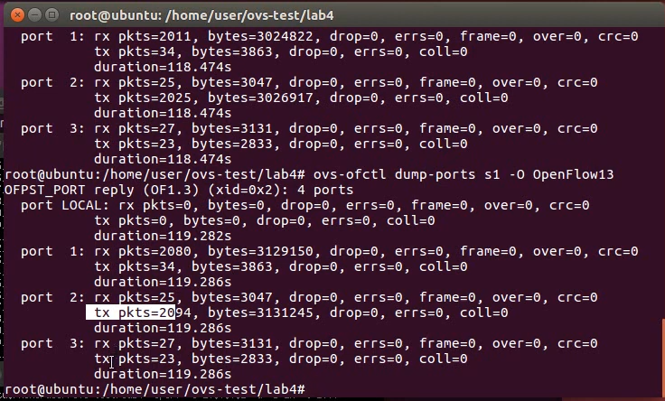

- 中斷S1與S2的連線
    - `link s1 s2 down`

#### 發現變成PORT3改變

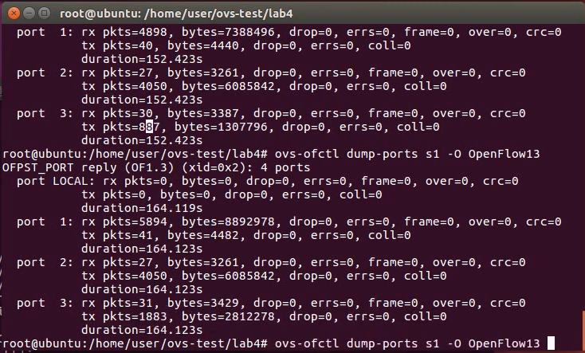

- 恢復s1與s2的連線
    - link s1 s2 up

#### 發現又變成PORT2改變

### Q3
- 預設port2與port4為資料傳輸線路，發生問題時切換到port3與port5

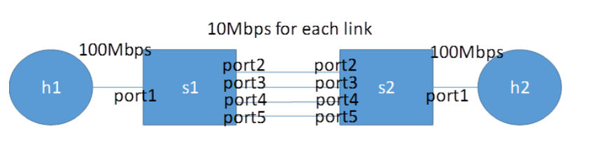

- group-chaining.py
```
from mininet.net import Mininet

from mininet.node import Controller, RemoteController, OVSKernelSwitch, UserSwitch, OVSSwitch

from mininet.cli import CLI

from mininet.log import setLogLevel

from mininet.link import Link, TCLink

 

def topology():

        net = Mininet( controller=RemoteController, link=TCLink, switch=OVSKernelSwitch)

 

        # Add hosts and switches

        h1= net.addHost( 'h1', mac="00:00:00:00:00:01" )

        h2 = net.addHost( 'h2', mac="00:00:00:00:00:02" )

        s1 = net.addSwitch( 's1', protocols=["OpenFlow10,OpenFlow13"], listenPort=6634 )

        s2 = net.addSwitch( 's2', protocols=["OpenFlow10,OpenFlow13"], listenPort=6635 )

        c0 = net.addController( 'c0', controller=RemoteController, ip='127.0.0.1', port=6633 )

            linkopt={'bw':10}

        linkopt2={'bw':100}

        net.addLink( h1, s1, cls=TCLink, **linkopt2)

        net.addLink( h2, s2, cls=TCLink, **linkopt2)

        net.addLink( s1, s2, cls=TCLink, **linkopt)

        net.addLink( s1, s2, cls=TCLink, **linkopt)

        net.addLink( s1, s2, cls=TCLink, **linkopt)

        net.addLink( s1, s2, cls=TCLink, **linkopt)

 

        net.build()

        c0.start()

        s1.start( [c0] )

        s2.start( [c0] )

 

        print "*** Running CLI"

       h1.cmd("arp -s 10.0.0.2 00:00:00:00:00:02")

        h2.cmd("arp -s 10.0.0.1 00:00:00:00:00:01")

        CLI( net )

        print "*** Stopping network"

        net.stop()

 

if __name__ == '__main__':

    setLogLevel( 'info' )

    topology()  
```

- rule.sh
```
ovs-ofctl -O OpenFlow13 add-flow s2 in_port=2,actions=output:1

ovs-ofctl -O OpenFlow13 add-flow s2 in_port=3,actions=output:1

ovs-ofctl -O OpenFlow13 add-flow s2 in_port=4,actions=output:1

ovs-ofctl -O OpenFlow13 add-flow s2 in_port=5,actions=output:1

ovs-ofctl -O OpenFlow13 add-flow s2 in_port=1,actions=output:5

ovs-ofctl -O OpenFlow13 add-flow s1 in_port=5,actions=output:1

ovs-ofctl -O OpenFlow13 add-group s1 group_id=2,type=select,bucket=output:2,bucket=output:4

ovs-ofctl -O OpenFlow13 add-group s1 group_id=3,type=select,bucket=output:3,bucket=output:5

ovs-ofctl -O OpenFlow13 add-group s1 group_id=1,type=ff,bucket=watch_port:2,group:2,bucket=watch_port:3,group:3

ovs-ofctl -O OpenFlow13 add-flow s1 in_port=1,actions=group:1
```

- 執行
    - cmd1
        - `python fast-failover.py`
    - cmd2
        - `chmod +x rule.sh`
        - `./rule.sh`
    - cmd2 查看s1 flow與group的狀況
        - `ovs-ofctl dump-flows s1 -O OpenFlows13`
        - `ovs-ofctl dump-groups s1 -O OpenFlows13`

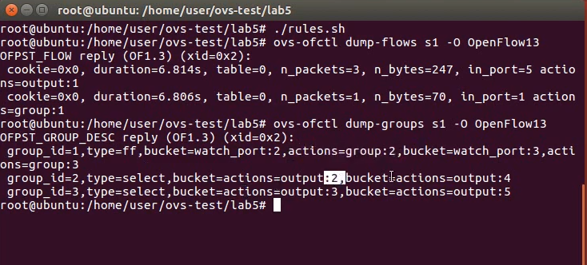

- mininet
    - `xterm h1 h1 h2 h2`
        - h1 `iperf -c 10.0.0.2 -p 5555 -t 100`
        - h2 `iperf -s -i 1 -p 5555`
    - `ovs-ofctl dump-ports s1 -O OpenFlows13` 

    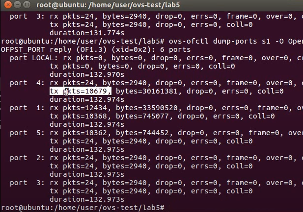
    #### 觀察到PORT4再變化

    - h1 `iperf -c 10.0.0.2 -p 5566 -t 100`
    - h2 `iperf -s -i 1 -p 5566`

    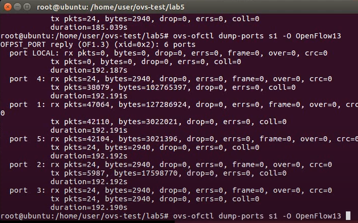
    #### 觀察到PORT4及PORT2都有變化

- ubuntu 
    - `ovs-ofctl mod-port s1 s1-eth2 down`

    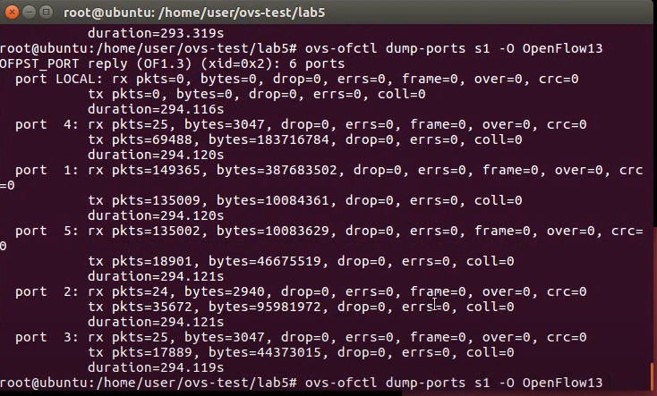
    #### 觀察到PORT3及PORT5都有變化
