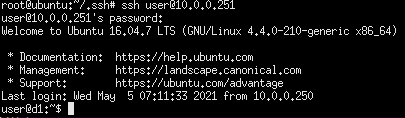
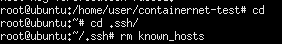

## ContainerNet


### 在不同的host,採用不同的image,去執行不同的ssh server
- term1
```
cd /home/user/containernet
python3 ./setup.py install
```

```
docker pull ubuntu:16.04
docker run -it ubuntu:16.04 bash
apt update
apt install openssh-server -y
```
```
adduser user
user1
user2
```
- 建立user1和user2的image檔
```
docker ps 
docker commit 832 ubuntu:sshd1
docker images
```

- ifconfig工具  
    - `apt-install net-tools` 
- ping工具
    - `apt-install iputils-ping` 

- 執行腳本

```
cd /home/user/containernet/container-test
python3 1.py
```
- 啟動ssh伺服器
```
docker exec -it mn.d1 bash
ifconfig d1-eth0 10.0.0.251/24
/etc/init.d/ssh start
```
```
docker exec -it mn.d2 bash
ifconfig d1-eth0 10.0.0.252/24
/etc/init.d/ssh start
```

- 登入
```
xterm h1
ssh user@10.0.0.251
ssh user@10.0.0.252
```



- 無法登入的解決辦法  



### 參考資料

[教學影片](https://www.youtube.com/watch?v=RpgX07v7DiY&t=792s)