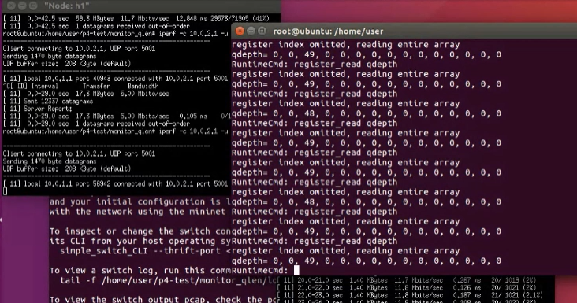
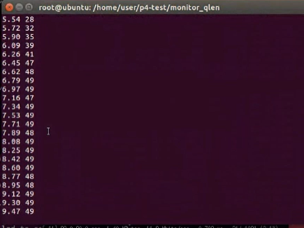
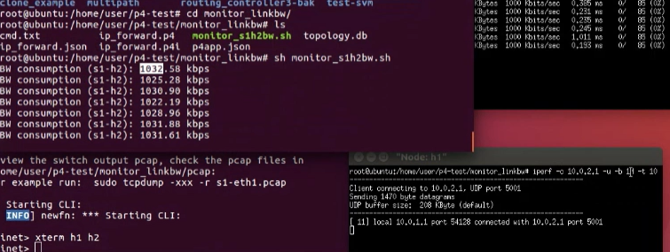

## 05-24上課


### monitor_qlen

 ### 執行
- term1
    - `p4run`
    - `xterm h1 h2`
    - h2
        - `iperf -s -i 1 -u`
    - h1
        - `iperf -c 10.0.2.1 -u -b 20M -t 100`

- term2
    - `simple_switch_CLI --thrift-prt 9090`:連接交換機
    - `register_read qdeth`:查看佇列



- 腳本控制
    - monitor_qlens1h2.sh
```
#!/bin/bash

CLI_PATH=/usr/local/bin/simple_switch_CLI

#get current unix time in milliseconds
prev_time=`date +%s%N | cut -b1-13`


while true; do
  qlen=`echo register_read qdepth 2 | $CLI_PATH --thrift-port 9090 | grep qdepth | awk '{print $3}'`       

  now=`date +%s%N | cut -b1-13` 
  time=$(echo "scale=2; ($now -  $prev_time) / 1000.0"| bc -l)
  echo $time $qlen
  sleep 0.1
done
```
- `echo "register_read_qdepth [index]" | simple_switch_CLI --thrift-prt 9090`

- `sh monitor_qlens1h2.sh`:查看register




### monitor_linkbw

- 執行 
    - `p4run`
    - `xterm h1 h2`

    - h1
        - `iperf -c 10.0.2.1 -u -b 1M -t 10`
    - h2
        - `iperf -s -i 1 -u` 

   