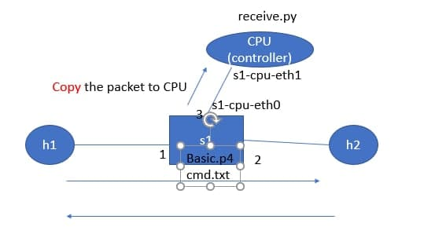
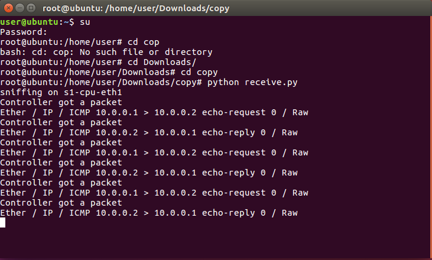
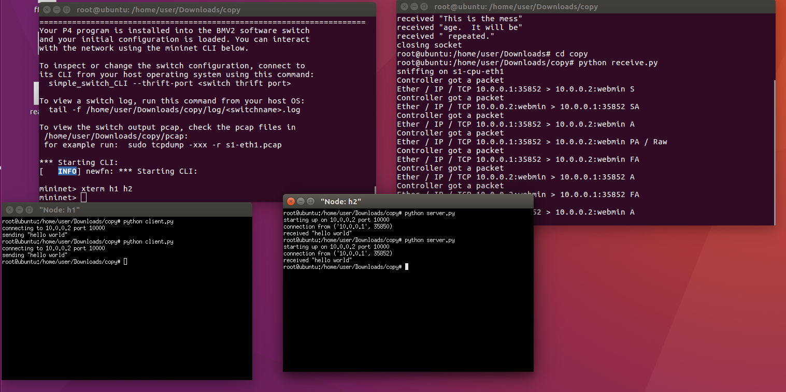
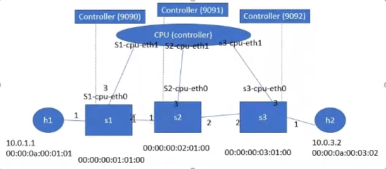
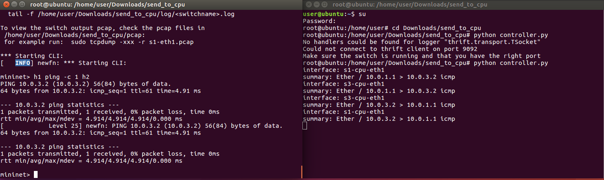
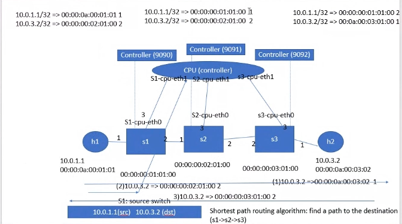
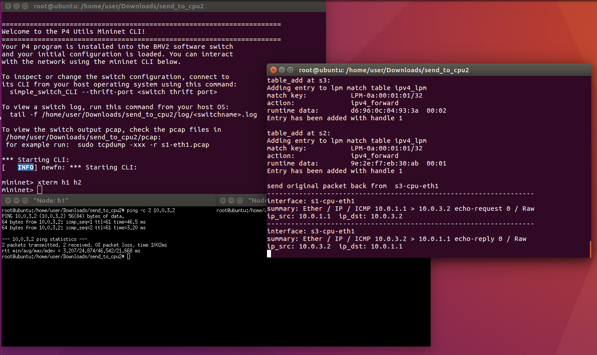
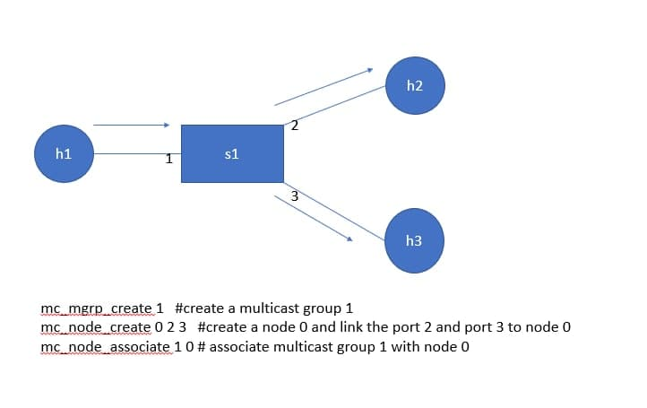
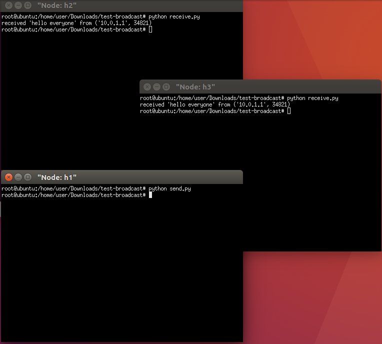
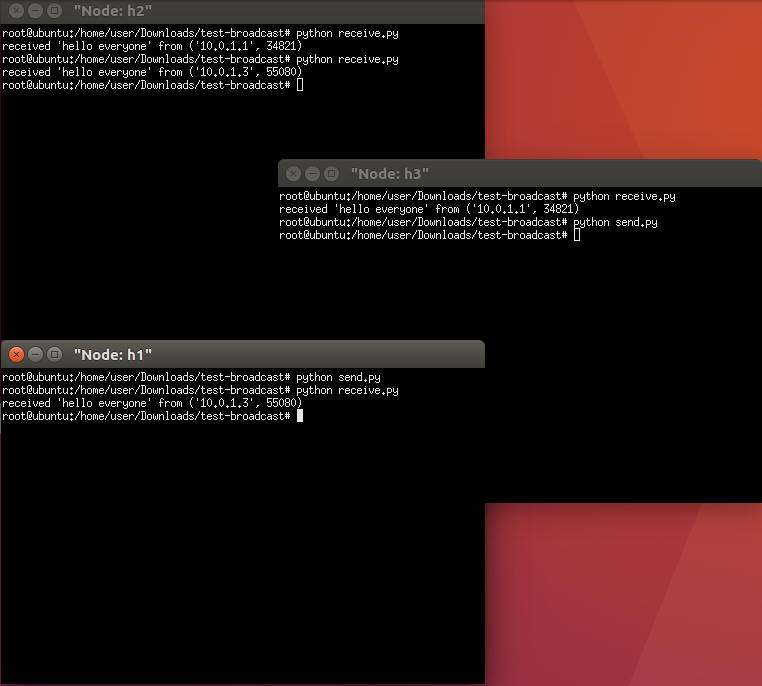

## 05-31上課

- COPY-TO-CPU實驗  




- TCP
    - server
    ```
    import socket
    import sys

    # Create a TCP/IP socket
    sock = socket.socket(socket.AF_INET, socket.SOCK_STREAM)

    # Bind the socket to the port
    server_address = ('10.0.0.2', 10000)
    print >>sys.stderr, 'starting up on %s port %s' % server_address
    sock.bind(server_address)

    # Listen for incoming connections
    sock.listen(1)

    connection, client_address = sock.accept()
    print >>sys.stderr, 'connection from', client_address
    data = connection.recv(1024)
    print >>sys.stderr, 'received "%s"' % data
    connection.close()
    ```
    - client
    ```
    import socket
    import sys

    # Create a TCP/IP socket
    sock = socket.socket(socket.AF_INET, socket.SOCK_STREAM)

    # Connect the socket to the port where the server is listening
    server_address = ('10.0.0.2', 10000)
    print >>sys.stderr, 'connecting to %s port %s' % server_address
    sock.connect(server_address)

    # Send data
    message = 'hello world'
    print >>sys.stderr, 'sending "%s"' % message
    sock.sendall(message)
    sock.close()
    ```



- SENT-TO-CPU實驗   




- SENT-TO-CPU2實驗  





### 範例
- p4的broadcast與multicast



- h1 send h2、h3 receive



- 同理，h3 send h1、h2 receive

