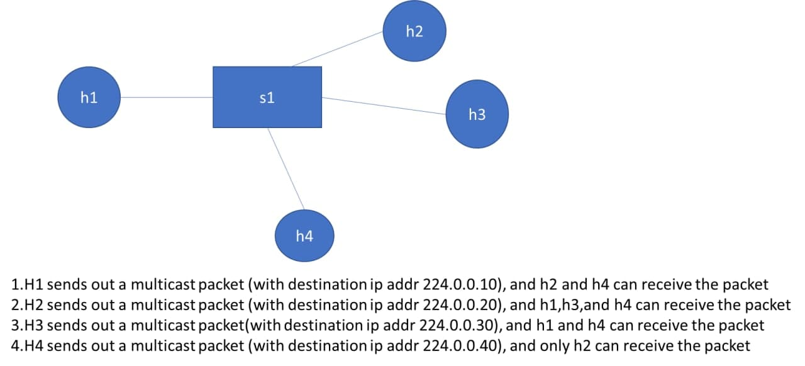
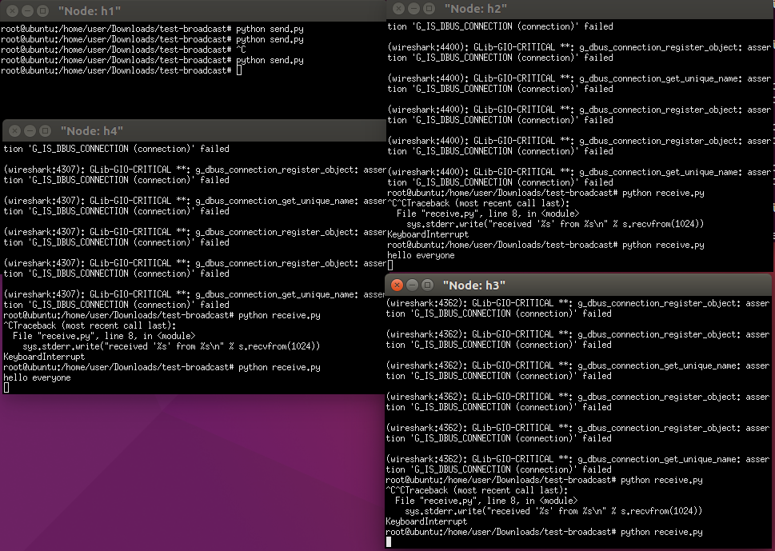
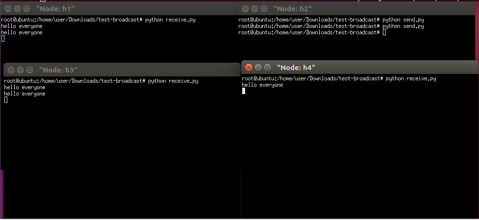
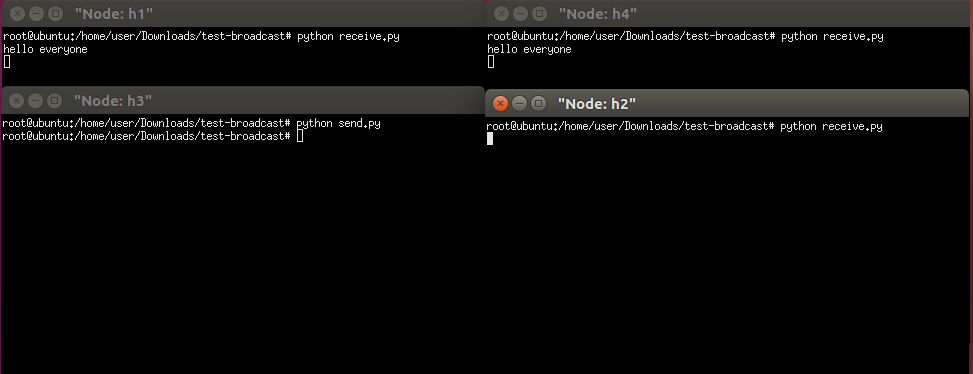
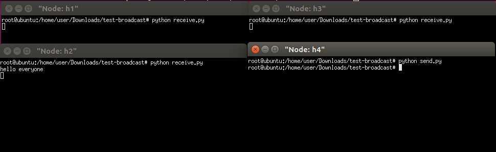
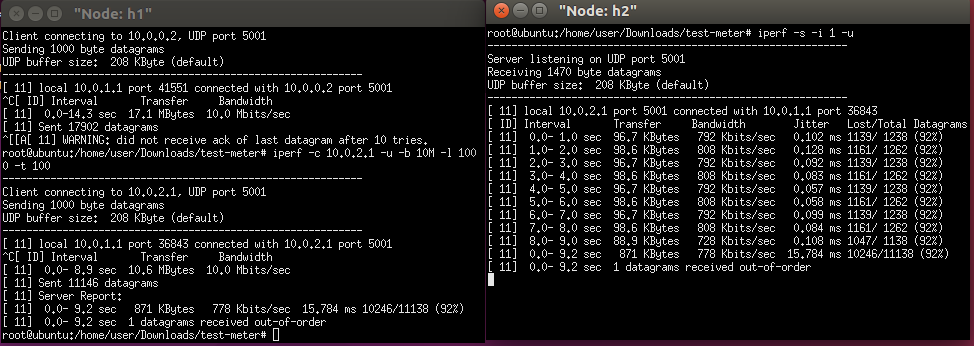
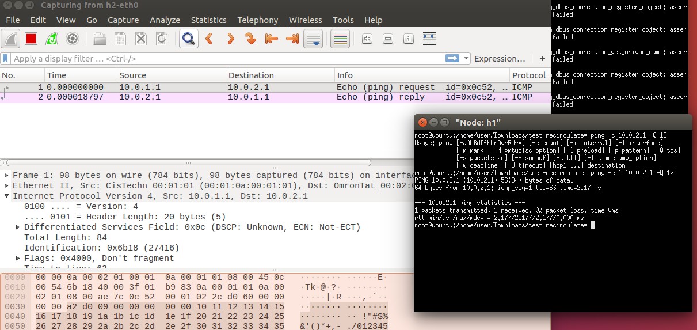
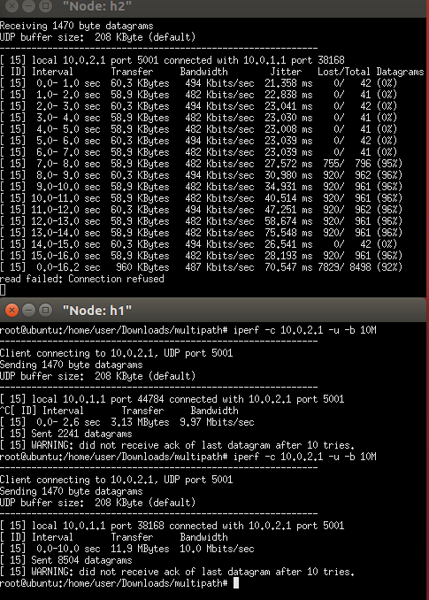
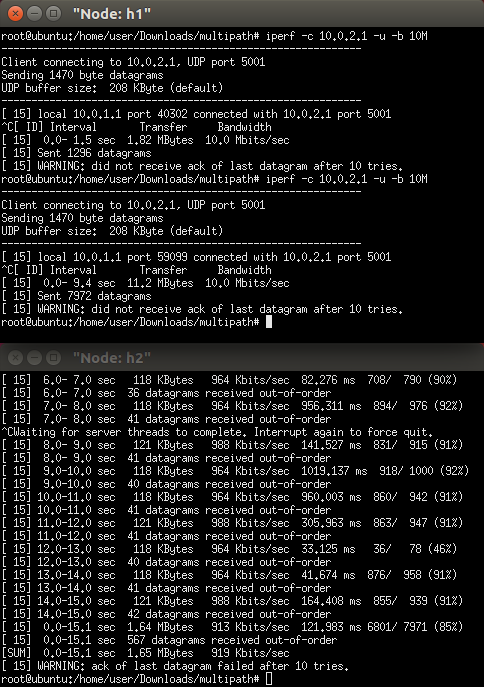

## 06-07上課



### Q1
    - p4app.json 新增節點
    ```
    "links": [["h1", "s1"], ["h2", "s1"], ["h3", "s1"], ["h4", "s1"]],
    "hosts": {
      "h1": {
      },
      "h2": {
      },
      "h3": {
      },
      "h4": {
      }
    },
    ```

- cmd.txt 更改規則
```
table_add mac_forward forward 00:00:0a:00:01:01 => 1
table_add mac_forward forward 00:00:0a:00:01:02 => 2
table_add mac_forward forward 00:00:0a:00:01:03 => 3
table_add ip_broadcast broadcast 224.0.0.10 1 => 1

mc_mgrp_create 1
mc_node_create 0 2 4
mc_node_associate 1 0
```
- send.py 更改ip
```
s.sendto('hello everyone', ('224.0.0.10', 1234))
```
- receive.py
```
import socket
import struct

MCAST_GRP = '224.0.0.10'
MCAST_PORT = 1234
IS_ALL_GROUPS = True

sock = socket.socket(socket.AF_INET, socket.SOCK_DGRAM, socket.IPPROTO_UDP)
sock.setsockopt(socket.SOL_SOCKET, socket.SO_REUSEADDR, 1)
if IS_ALL_GROUPS:
    # on this port, receives ALL multicast groups
    sock.bind(('', MCAST_PORT))
else:
    # on this port, listen ONLY to MCAST_GRP
    sock.bind((MCAST_GRP, MCAST_PORT))
mreq = struct.pack("4sl", socket.inet_aton(MCAST_GRP), socket.INADDR_ANY)

sock.setsockopt(socket.IPPROTO_IP, socket.IP_ADD_MEMBERSHIP, mreq)

while True:
# For Python 3, change next line to "print(sock.recv(10240))"
print sock.recv(10240)
```


### Q2  

- cmd.txt 更改規則
```
table_add mac_forward forward 00:00:0a:00:01:01 => 1
table_add mac_forward forward 00:00:0a:00:01:02 => 2
table_add mac_forward forward 00:00:0a:00:01:03 => 3
table_add ip_broadcast broadcast 224.0.0.20 2 => 2

mc_mgrp_create 2
mc_node_create 0 1 3 4
mc_node_associate 2 0
```
- send.py 更改ip
```
s.sendto('hello everyone', ('224.0.0.20', 1234))
```
- receive.py
```
import socket
import struct

MCAST_GRP = '224.0.0.20' 更改ip
MCAST_PORT = 1234
IS_ALL_GROUPS = True
```




### Q3  

- cmd.txt 更改規則
```
table_add mac_forward forward 00:00:0a:00:01:01 => 1
table_add mac_forward forward 00:00:0a:00:01:02 => 2
table_add mac_forward forward 00:00:0a:00:01:03 => 3
table_add ip_broadcast broadcast 224.0.0.30 3 => 3

mc_mgrp_create 3
mc_node_create 0 1 4
mc_node_associate 3 0
```
- send.py 更改ip
```
s.sendto('hello everyone', ('224.0.0.30', 1234))
```
- receive.py
```
import socket
import struct

MCAST_GRP = '224.0.0.30' 更改ip
MCAST_PORT = 1234
IS_ALL_GROUPS = True
```



### Q4  

- cmd.txt 更改規則
```
table_add mac_forward forward 00:00:0a:00:01:01 => 1
table_add mac_forward forward 00:00:0a:00:01:02 => 2
table_add mac_forward forward 00:00:0a:00:01:03 => 3
table_add ip_broadcast broadcast 224.0.0.40 4 => 4

mc_mgrp_create 4
mc_node_create 0 2
mc_node_associate 2 0
```
- send.py 更改ip
```
s.sendto('hello everyone', ('224.0.0.40', 1234))
```
- receive.py
```
import socket
import struct

MCAST_GRP = '224.0.0.40' 更改ip
MCAST_PORT = 1234
IS_ALL_GROUPS = True
```


meter 調節傳輸速度

### test-meter





### test-recirculate


- h1 
    - `ping -c 1 10.0.2.1 -Q 12`  `-Q`:用來設定封包tos欄位
- h2
    - `wireshark`



- 1到10之間設為0，大於10固定不變


### Multipath transmission


- 先用singlepath執行一次



#### 可以看到bw大概在500左右

- 再用multipath執行



#### 增加到將近1000