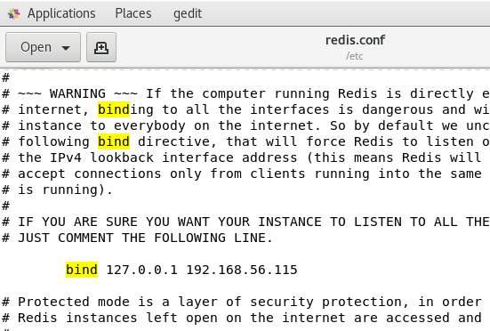
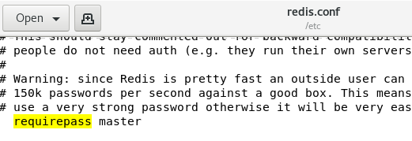
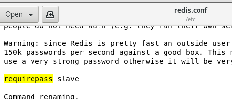
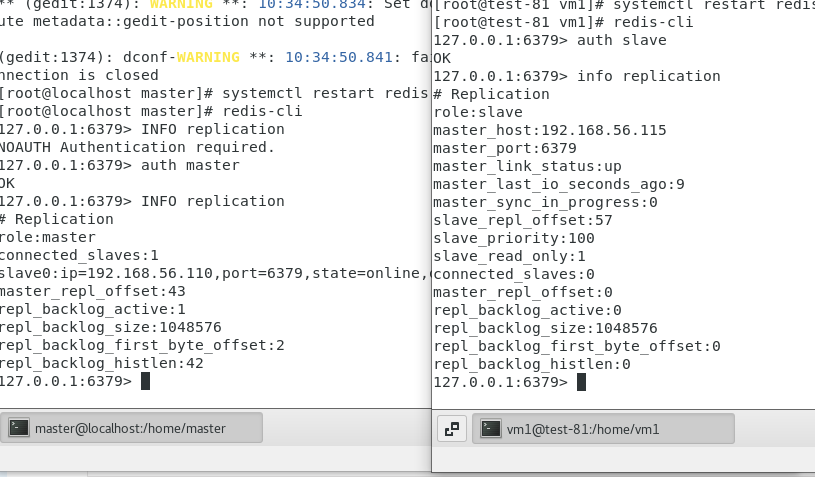

# Redis期末

## 記憶體資料庫是知名網站慣用快取工具
- 記憶體資料庫（In-memory Database）就是將資料儲存在記憶體的NoSQL資料庫，包括了Memcached、Redis、Velocity、Tuple space等。其實像Memcached、Redis都是一種Key-Value資料架構的資料庫，只是這類資料庫改將資料儲存在記憶體中來提高讀取效率，大多用來快取常用網頁，加快傳遞網頁的速度，減少讀取硬碟的次數，不過系統關機後就無法保存。
- 除了老牌的Memcached以外，2009年出現了一個新的開源記憶體資料庫Redis。除了提供分散式的快取以外，Redis和Memcached最大的不同點是，Redis提供了一個資料架構，可以自動排序那些儲存在Redis中的資料，讓開發者取得排序後的資料。


##　安裝
```
yum install epel-release

yum install redis

systemctl enable redis

redis-cli ping(確認redis成功安裝且正運行)

```
## 環境

## 配置檔設定
- MASTER

- SLAVE

- confirm replication

- 密碼認證
    - MASTER

    -SLAVE


- 確認連接
